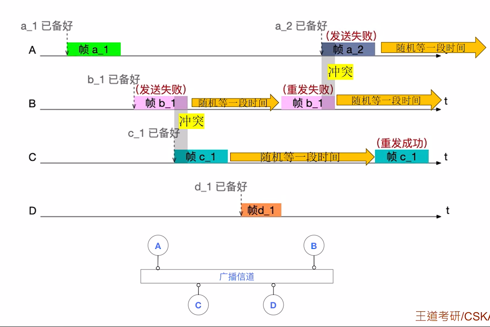

$$介质访问控制$$

**介质访问控制（Medium Access Control，MAC）**：多个节点共享一个“总线型”广播信道时，可能发生“信号冲突”。

- 如：
  - 有线通信：
    - 早期用一条同轴电缆连接多个节点的网络。
    - 用集线器连接多个节点的网络。
  - 无线通信：
    - WiFi、5G 等无线通信。

- **广播信道** 需要实现此功能。
  - 广播信道在逻辑上是总线型拓扑，**多个结点需争抢传输介质的使用权**。

- **点对点信道** 通常不需要此功能。
  - 点对点信道意味着 **两个结点之间有专属的传输介质，不用抢**。

常见的介质访问控制方法有 **信道划分介质访问控制**、**随机访问介质访问控制**、**轮询访问介质访问控制**。
- 前者是 **静态划分信道** 的方法，后两者是 **动态分配** 信道的方法。

# 一、信道划分介质访问控制

## （一）时分复用（TDM）

**时分复用（Time Division Multiplexing，TDM）**：将时间分为 **等长的“TDM 帧”**，每个“TDM 帧”又分为 **等长的 m 个“时隙”**，将 m 个时隙分配给 m 对用户（节点）使用。

{width=700}

- **缺点**：
  - 每个节点 **最多只能分配到信道的总带宽的 $1 \over m$**
  - 如果某节点暂不发送数据，会导致被分配的“时隙”闲置，**信道利用率低**。
    - 解决方法：可 **统计** 每个节点对信道的使用需求，**动态按需分配时隙**。

## （二）统计时分复用（STDM）

**统计时分复用（Statistic Time Division Multiplexing，STDM，异步时分复用）**：在 TDM 的基础上，**动态按需分配时隙**。

- **优点**：
  - 如果需要时，一个节点可以在一段时间内 **获得所有的信道带宽资源**。
  - 如果某节点暂不发送数据，可以不分配“时隙”，**信道利用率更高**。

## （三）频分复用（FDM）

**频分复用（Frequency Division Multiplexing，FDM）**：是 **将信道的总频带划分为多个子频带**，每个子频带作为一个子信道，每对用户使用一个子信道进行通信。

{width=700}

- **优点**：
  - 各节点可同时发送信号。
  - 充分利用了信道带宽（Hz）。

- **缺点**：FDM 技术 **只能用于模拟信号** 的传输。

## （四）波分复用（WDM）

**波分复用（Wavelength Division Multiplexing，WDM）**：**光的频分复用**。

{width=700}

- 光信号的频带范围（带宽）非常大，因此很适合采用波分复用技术，将一根光纤在逻辑上拆分为多个子信道。

## （五）码分复用（CDM）

**码分复用（Code Division Multiplexing，CDM）** 技术允许信号相互干扰，相互 **叠加**。接收方有办法将来自各节点的信号值 **分离** 出来。

1. 给各节点分配专属“码片序列”：
   - **码片序列** 包含 m 个码片（信号值），可看作 **m 维向量**（m 维向量的 **分量通常取 1 或 -1**）。
   - 要求：各节点的 m 维向量 **必须相互正交**。
   - 注意：相互通信的各节点知道彼此的码片序列。

2. 发送方如何发送数据：
   - 节点发出 m 个信号值与 **码片序列相同**，表示 **比特 1**。
   - 节点发出 m 个信号值与 **码片序列相反**，表示 **比特 0**。

3. 信号在传输过程中叠加：当多个发送方同时发送数据时，**信号值会叠加**。
   - 本质是多个 **m 维向量的加法**。

4. 接收方如何接收数据：
   - 接收方收到的是叠加信号，需要从中分离出各发送方的数据。
   - **叠加信号** 与 **发送方的码片序列** 作 **规格化内积**。
     - **结果为 1，表示比特 1**。
     - **结果为 -1，表示比特 0**。

    

    {width=700}
    {width=700}
    {width=700}
    

# 二、随机访问介质访问控制

## （一）ALOHA 协议

### 1. 纯 ALOHA 协议

纯 ALOHA 协议 **要点**：如果准备好数据帧，就 **立刻发送**。

{width=400}
{width=700}

### 2. 时隙 ALOHA 协议

- 时隙 ALOHA 协议 **要点**：
  - **时隙大小固定 = 传输一个最长帧所需时间**
  - **只有在每个时隙开始时才能进发送帧**。

{width=400}
{width=700}

## （二）CSMA 协议

**CSMA 协议（Carrier Sense Multiple Access，载波监听多路访问协议）**：在 ALOHA 协议基础上提出改进，**在发送数据之前，先监听信道是否空闲，只有信道空闲时，才会尝试发送**。

- 节点的 **网络适配器** 安装 **载波监听装置**。

### 1. 1-坚持 CSMA

发送前先监听信道，若信道空闲 **立即发送** 数据帧（**发送概率为 1**）。

- **坚持** 指如果信道不空闲，节点会坚持监听信道。

{width=700}

- **优点**：信道利用率高，信道一旦空闲，就可以被下一个节点使用。

- **缺点**：当多个节点都已准备好数据时，一旦信道空闲，会有多个节点同时发送数据，冲突概率大。

### 2. 非坚持 CSMA

发送前先监听信道，若信道空闲 **立即发送** 数据帧（**发送概率为 1**）。

- **非坚持** 指如果信道不空闲，节点不会坚持监听信道，而是 **随机推迟一段时间后在尝试监听**。

{width=700}

- **优点**：当多个节点都已准备好数据时，如果信道补空闲，则各节点会 **随机推迟一段时间再尝试监听**，从而使 **各节点“错开”发送数据**，降低冲突概率。

- **缺点**：信道刚恢复空闲时，可能不会被立即利用，导致信道利用率降低。

### 3. p-坚持 CSMA

发送前先监听信道，若信道空闲则以 **概率 p 立即发送** 帧，以 **概率 1-p 推迟一段时间** 再发送。

{width=700}

- **优点**：属于 1-坚持 CSMA、非坚持 CSMA 的折中方案，降低冲突概率的同时，提升信道利用率。

## （三）CSMA/CD 协议

**CSMA/CD 协议（CSMA Collision Detection，载波监听多路访问/冲突检测协议）**：边发送边监听，检测到冲突立即停发。

- 用于早期的有线以太网（总线型）。如：
  - 用同轴电缆连接多个节点组成的有线局域网。
  - 用集线器连接多个节点组成的有线局域网。

- **协议要点**：
  - 先听后发，边听边发，**冲突停发**，**随机重发**。
  - 如何 **随机重发**：
    - **截断二进制指数退避算法**：
      - 随机等待一段时间 = **r** 倍 **争用期**（一段固定大小的时间），其中 **r 是随机数**。
      - 如果 **$k \leq 10$**，在 $[0,(2^k - 1)]$ 区间随机取一个整数 r
      - 如果 **$k > 10$**，在 $[0,(2^{10} - 1)]$ 区间随机取一个整数 r
  - 特别注意：
    - **第 10 次** 冲突，是“随机重发”的分水岭。
    - **第 16 次** 冲突，直接躺平，放弃传帧，报告上级（网络层）。

{width=700}

- **争用期** = 2 $\times$ **最大** 单向传播时延（考虑距离最远的两个节点）
  - 若 **争用期** 内未发生冲突，就不可能再冲突。
  - CSMA/CD **没有 ACK 机制**，若发送过程中未检测到冲突，就认为帧发送成功。
    

    {width=700}
    

- **最短帧长** = 2 $\times$ **最大** 单向传播时延 $\times$ 信道带宽
  - 若收到的帧 **小于最短帧长**，视为 **无效帧**。
    

    {width=700}
    {width=400}
    

- **最长帧长**：规定最长帧长可防止某些节点一直占用信道。

- **以太网规定**：
  - 最短帧长 = 64 B
  - 最长帧长 = 1518 B

## （四）CSMA/CA 协议

**CSMA/CA 协议（CSMA Collision Avoidance，载波监听多路访问/冲突避免协议）**：发送过程中不用检测冲突，发送前想办法避免冲突。（但无法完全避免）

- 用于 IEEE 802.11 无线局域网（WiFi）。

- **AP（Access Point，接入点）**：就是平时连接的无线 **WiFi 热点**。
  - 家用路由器 = 路由器 + 交换机 + AP
  - 校园网 = 路由器 + n 个交换机 + n $\times$ m 个 **AP**
  - 漫游：切换 WiFi 热点。

- CSMA/CD 协议不适用于无线通信的原因
  

  {width=700}
  

- CSMA/CA 协议 **要点**：
  - **发送方：先听后发，忙则退避**。
    - 若信道 **空闲**，**间隔 DIFS** 后，再发送帧（**一口气发完，发送过程中不用检测冲突**）。
    - 若信道 **不空闲**，则进行 **随机退避**。
  - **随机退避** 原理：
    - 用二进制指数退避算法确定一段随机退避时间（倒计时）。
    - **发送方** 会保持监听信道，**只有信道空闲时才“扣除倒计时”**，倒计时结束后立即发送帧（此时信道听起来一定空闲）。
  - **接收方：停止等待协议**：
    - 每收到一个正确数据帧都返回 ACK。
    - 若 **发送方** 超时未收到 ACK，则进行 **随机退避**。

- **帧间间隔 IFS**：
  - **DIFS**：最长的 IFS，每次帧事务开始之前需要等待的时间。
  - **SIFS**：最短的 IFS，收到一个帧后需要预留的一段处理时间。
  - **PIFS**：中等长度的 IFS。
  

  {width=700}
  

- **信道预约机制（可选功能）**：**先预约，再发送**。可以解决“隐藏站”问题。
  - **发送方** 广播 **RTS 控制帧**（**先听后发，忙则退避**）
  - AP 广播 **CTS 控制帧**。
  - 其他 **无关节点** 收到 CTS 后自觉 **禁言** 一段时间（即：虚拟载波监听机制）
  - **发送方** 收到 CTS 后，就可以发送数据帧。
  - AP 收到数据帧后，进行 CRC 校验，若无差错就返回 ACK 帧。
  

  {width=700}
  

# 三、轮询访问介质访问控制

典型的轮询访问控制协议是 **令牌传递协议**。

- **令牌环网技术**：IBM 公司于 1984 开发的一种局域网技术。
  - 环形拓扑结构，各节点 **轮询访问** 信道，**不会发生信道冲突**。
  - 通过 **令牌传递协议** 实现介质访问控制。

- 令牌传递协议 **要点**：
  - **令牌帧**：
    - 需指明当前 **获得令牌的节点编号**。
    - 只有获得 **令牌（Token）** 的节点才能往信道上发送数据帧。
    - 如果获得令牌的节点 **没有数据要发送**，就 **将令牌传递下一个节点**。
  - **数据帧**：发送数据时，令牌帧转换为数据帧。
    - 需指明数据帧的 **源地址/目的地址**、**是否已被接受**、**获得令牌的节点编号**。
    - 数据帧从源节点出发，传递一圈后回到源节点。
    - 数据帧传递一圈的过程中，会被 **目的节点** 复制一份数据，并将数据帧标记为 **已接收**。
    - 数据帧回到源节点后，如果发现 **异常** 情况，就尝试 **重发**；若 **无异常**，就 **将令牌传递下一个节点**。
      - 有重发次数上限，如果到达上限，就放弃发送该数据帧。

- 注意：
  - 无论是令牌帧还是数据帧，都只能沿单向传递。
  - 获得令牌的节点，每次只能发一帧，发完就释放令牌。
  - 需要用专门的网络设备（MAU）实现 **集中控制**。
    - **MAU（Multistation Access Units，多站接入单元）**：**用于集中控制“令牌环网”**，是令牌环网的集中控制站。
      

      {width=700}
      

  - 令牌传递协议很 **适合于负载高** 的网络（不会发送冲突，效率高）。