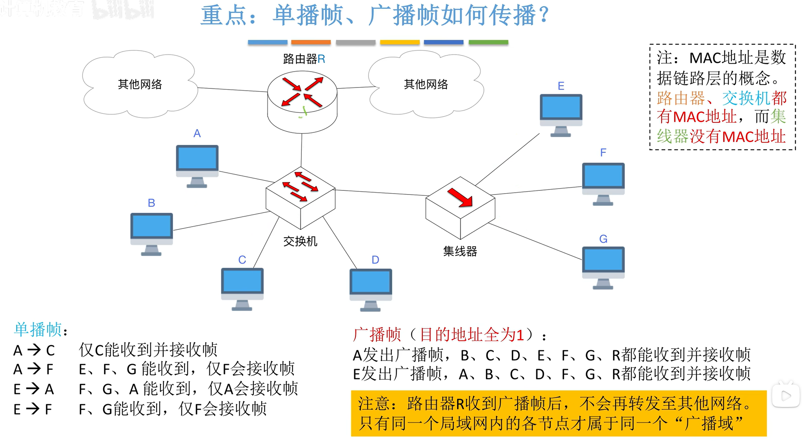

$$局域网$$

电子电气工程师学会（IEEE）下设有 IEEE 802 委员会，负责推进局域网技术标准化工作（还有其他工作）。
- IEEE 802 委员会下设有：
  - 802.8 工作组（已解散）
  - 802.5 工作组（已解散）
  - 802.3 工作组（负责以太网技术，即有线局域网技术）
    - 以太网技术的研究范畴：物理层、介质访问控制子层。
  - 802.11 工作组（负责 Wi-Fi 技术，即无线局域网技术）

- IEEE 802 委员会把数据链路层分为了介质访问控制子层和逻辑链路控制子层。
  - 介质访问控制子层（MAC 子层，Medium Access Control）：与传输介质有关的部分功能（组帧、差错检测、透明传输、介质访问控制等）。
  - 逻辑链路控制子层（LLC 子层，Logical Link Control）：与访问传输介质无关的部分功能，由 IEEE 802.2 工作组（已解散）负责。
    - LLC 子层的存在是为了兼容各种局域网技术。（LLC 子层目前已名存实亡）
    - 有线局域网已被 802.3 垄断。
    - 无线局域网已被 802.11 垄断。

# 一、局域网的基本概念与体系结构

## （一）局域网（LAN）的特点

1. 覆盖较小的地理范围。
2. 较低的时延和误码率。
3. 局域网内的各节点间以 **帧** 为单位进行传输。
4. 支持 **单播**、**广播**、**多播**。
   - **单播（一对一发送帧）**：如 A $\rightarrow$ B。
   - **广播（一对全部发送帧）**：如 A $\rightarrow$ B + C + D + E + F + G
   - **多播（一对部分发送帧）**：如 A $\rightarrow$ B + D + E
   - **MAC 地址（物理地址，48 bit）**：每个节点至少会拥有一个 MAC 地址，且全球唯一，用来标识节点。

## （二）局域网的分类

- 关注三个要素：
  - 拓扑结构
  - 传输介质
  - 介质访问控制方式

### 1. 有线局域网（LAN）

#### （1）令牌环网（Token Ring）

- 拓扑结构：**环形**。
- 传输介质：**同轴电缆** 或 **双绞线**。
- 介质访问控制方式：**令牌传递协议**。

#### （2）以太网/802.3（Ethernet）

- 物理层采用 **曼彻斯特编码**。
- **同轴电缆** 以太网（早期）
  - 10Base5
  - 拓扑结构：**总线形**。
  - 传输介质：**同轴电缆（可用中继器连接多个同轴电缆网段）**。
  - 介质访问控制方式：**CSMA/CD协议**。
- **双绞线** 以太网
  - 10BaseT
  - 用 **集线器** 连接
    - 拓扑结构：物理上星形，**逻辑上总线形**。
    - 传输介质：**双绞线（用集线器连接）**。
    - 介质访问控制方式：**CSMA/CD 协议**。（半双工通信）
  - 用 **交换机** 连接
    - 拓扑结构：**物理上、逻辑上都是星形**。
    - 传输介质：**双绞线（用交换机连接）**。
    - 介质访问控制方式：**CSMA/CD 协议** 或 **NULL**
      - **半双工** 模式下，采用 **CSMA/CD** 争抢信道。
      - **全双工** 模式下，**不用争抢信道**，也就不需要使用 CSMA/CD 协议。
      - 不是所有网线都会使用 **4 对双绞线**（支持 **全双工** 通信）。
      - 早期的网线 **只包含 1 对双绞线**（只能支持 **半双工** 通信）。
- **光纤** 以太网（用于扩大以太网覆盖范围）
  - 10BaseF
  - 拓扑结构：**点对点**（用于中继器/集线器/交换机之间的传输，也就是说通常不会直接连接终端节点）
  - 传输介质：**光纤**。
  - 介质访问控制方式：**NULL**（用两条光纤实现 **全双工** 通信）。

### 2. 无线局域网（WLAN）

- **WiFi/802.11**
  - 拓扑结构：IEEE 802.11 定义为 **星形**（1 个 AP + N 台移动设备）。
  - 传输介质：**无线（Wireless）**。
  - 介质访问控制方式：**CSMA/CA 协议**。

## （三）局域网的硬件架构

- **MAC 地址（物理地址，48 bit）**：每个节点至少会拥有一个 MAC 地址，且全球唯一，用来标识节点。
  - 全球的 MAC 地址由 IEEE 管理。
  - 网络适配器厂商需要向 IEEE 申请 MAC 地址段。
  - IEEE 允许 MAC 地址段（高 24 bit 为厂商号，不可随意修改，低 24 bit 由厂商分配）。
  - MAC 地址写在网络适配器（以太网适配器/WiFi 网络适配器）的 ROM 芯片上，无法修改。

- 网络适配器上的 RAM 芯片用于帧缓冲。

- **网络适配器（网络接口卡、网卡）**：
  - **负责把帧发送到局域网**。
    - 关于“将 IP 数据报（IP 分组）封装成帧”，有些系统由主机实现，有些系统由网络适配器负责。
  - **负责从局域网接收帧**。如果收到正确帧，就用“中断”通知 CPU；如果收到异常帧，就直接丢弃。
  - 需要根据接入的局域网类型，按照标准 **实现数据链路层 + 物理层功能**。
  - 需要完成数据的串/并行转换。
  - 需要支持帧缓冲。

{width=700}

# 二、以太网与 IEEE 802.3

## （一）IEEE 802.3 推出的以太网标准（物理层）

- **同轴电缆** 只能 **半双工**。
- **双绞线**
  - 速率 < 2.5 Gbps，可支持 **半双工** 或 **全双工**（节点连接时协商）。
  - 速率 $\geq$ 2.5 Gbps，仅支持 **全双工**。
- **光纤** 只支持 **全双工**。

{width=700}

- **速率 + Base + 传输介质信息**

{width=700}

- 如果一个网段工作在 **半双工** 模式下，**才需要使用 CSMA/CD 协议** 实现介质访问控制。

- 不同的网段可以采用不同的标准。
  - **同轴电缆网段仅支持半双工**。
  - 双绞线网段
    - 用 **集线器** 连接的节点，仅支持 **半双工** 模式。
    - 用 **交换机** 连接的默认 **终端** 节点都可以 **全双工**。
  - 光纤网段仅支持 **全双工**。

- 以太网的物理层使用 **曼彻斯特编码（跳 0 反跳 1 看中间，中必变）**。

## （二）两种常见的以太网 MAC 层标准

- 两种标准在 **帧** 格式上有细微差别，市面上 **常用 V2 标准**。

### 1. DIX Ethernet V2 标准

- **V2 标准的以太网 MAC 帧**：**6 6 2 N 4，收发协数验**。
  

  {width=700}
  

- 物理层会在 MAC 帧前添加 **8B 前导码（7B 同步，1B 定界）**。
- **目的地址全 1** 表示 **广播帧**。
  - 交换机会将收到的广播帧转发至其他端口。
  - 路由器不会转发广播帧。

- **单播帧、广播帧的传播**：
  

  {width=700}
  

  - 注意：
    - MAC 地址是数据链路层的概念。
      - **路由器、交换机都由 MAC 地址**。
      - **集线器没有 MAC 地址**。
    - 只有同一个局域网的各节点才属于同一个 **广播域**。

- **冲突域**：如果两个节点同时发送数据，会导致冲突，则二者处于同一个 **冲突域**。
- **广播域**：如果一个节点发送广播帧，可以被另一个节点接收，则二者处于同一个 **广播域**。
- 集线器不隔离冲突域，也不隔离广播域。
- 以太网交换机隔离冲突域，但不隔离广播域。
- 路由器既隔离冲突域，也隔离广播域。

### 2. IEEE 802.3 标准

- **IEEE 802.3 标准的以太网 MAC 帧**：6 6 **2** N 4，收发 **长** 数验。
  

  {width=700}
  

# 三、VLAN 基本概念与基本原理

- VLAN 由 IEEE 802.1Q 工作组负责。

- 一个大型局域网（如校园网）可能会面临的问题：
  - 局域网内任何一个节点发出的广播帧，都会被广播至所有节点，可能出现广播风暴。
  - 不安全，局域网内可能会有一些敏感节点。（如校园网服务器、学校数据中心）。

- **VLAN（Virtual LAN，虚拟局域网）**
  - 将一个大型局域网分割成若干个较小的 VLAN，**每个 VLAN 是一个广播域**。
  - 每个 VLAN 对应一个 **VID**。
  - 属于 **同一个 VLAN** 的计算机之间 **可以直接通信**，而 **不同 VLAN** 的计算机之间 **不能直接通信**。
  - 需要使用 **支持 VLAN 功能的以太网交换机** 来实现。

- 有三种划分 VLAN 的方式：
  1. **基于接口**：将交换机的若干接口划分为一个逻辑组。
     - 最简单、最有效。
     - 若主机离开了原来的接口，则可能进入一个新的子网。
      

      {width=700}
      

  2. **基于 MAC 地址**：按 MAC 地址将一些主机划分为一个逻辑子网。
     - 当主机的物理位置冲一个交换机移动到另一个交换机时，它仍属于原来的子网。
      

      {width=700}
      

  3. **基于 IP 地址**：根据网络层地址或协议划分 VLAN。
     - 这种方式 **可以让 VLAN 范围跨越路由器，让多个局域网的主机组成一个 VLAN**（需要 **网络层** 功能支持）。
      

      {width=700}
      

- **如果帧的传输跨越交换机，需指明 VID**。
  - **主机** 与 **交换机** 之间，传输 **标准以太网帧**。
    - **标准以太网帧**：6 6 2 N 4，收发协数验。
  - **交换机** 与 **交换机** 之间，传输 **802.1Q 帧**。
    - **802.1Q 帧**：6 6 **4** 2 N 4，收发 **V** 协数验。
    - 在 **标准以太网帧** 的源地址之后，插入 VLAN 标签，得到 **802.1Q 帧**。
    - **4** 字节 **V** LAN 标签 = 16 + 4 + **12** bit = 固定 + 随便 + **VID**。
      

      {width=700}
      

# 四、IEEE 802.11 无线局域网

## （一）无线局域网的分类

1. 有固定基础设施无线局域网：如 802.11 无线局域网（WiFi）。
2. 无固定基础设施移动自组织网络：如苹果隔空投送（AirDrop）、华为分享（HUAWEI Share）。

{width=700}
{width=700}

## （二）IEEE 802.11 无线局域网的基本概念

{width=700}

- **802.11 无线局域网** 是 **星形拓扑**，中心称为 **接入点（AP）**，也可称为 **无线接入点（WAP）**（即你连接的 WiFi 热点）。
  - **在 802.11 无线局域网内，两个移动站之间不能直接通信，必须通过基站（AP）转发。**

- **基本服务集 BSS**：1 个 **基站（AP）** + 多个移动站。（即 1 个 WiFi 热点连接了很多台手机电脑）
  - 移动站和基站间的通信，使用 **CSMA/CA 协议** 实现介质访问控制。
  - **服务集标识符 SSID**：无线局域网的名字（WiFi 名字），不能超过 32 字节。
  - **基本服务区 BSA**：一个基本服务集能够覆盖的地理范围。（站哪里可以搜到 WiFi）

- **门户（Portal）**：可将 802.11 无线局域网接入 802.3 有线以太网。

- **扩展服务集 ESS**：将多个 AP 连接到同一个 **分配系统**，组成一个更大的服务集。（子母路由器组成的全屋 WiFi）

- **漫游**：一个移动站从一个基本服务集切换到另一个基本服务集，仍然可以保持通信。（丝滑切换 WiFi 热点）

## （三）IEEE 802.11 局域网的 MAC 帧

- 802.11 帧的分类
  - **数据帧**
  - **控制帧**：如 ACK、RTS、CTS 帧。
  - **管理帧**：如探测请求帧（用于发现 WiFi）、探测相应帧。

- 802.11 局域网的 **数据帧格式**
  

  {width=700}
  

- 注意：
  - **802.11 帧** 用于 **无线链路** 传输，通常是 AP 与移动站之间的传输。
  - 在 **有线链路** 上通常使用 **以太网帧格式**。
  - **AP 与 AP** 之间、**AP 与路由器** 之间、**AP 与以太网交换机** 之间使用有线链路。
  - **AP 与移动站** 之间通过 **无线链路** 传输。
  - AP 通常具备 **帧格式转换** 功能。可以将 **无线链路** 上传输的 **802.11 帧** 格式，与 **有线链路** 上传输的 **以太网帧格式** 相互转换。