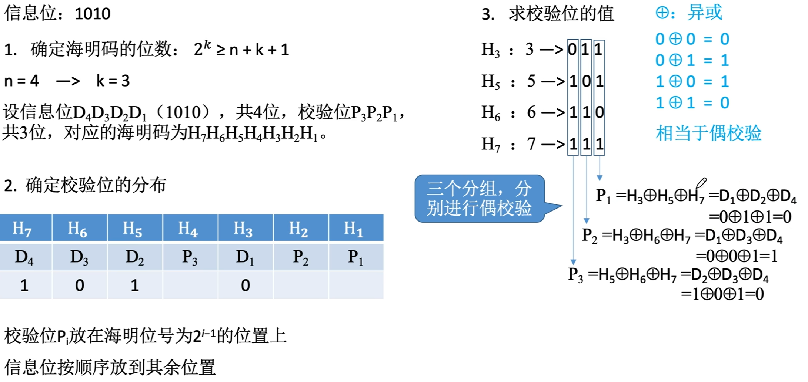

$$差错控制$$

差错控制目标：发现并解决一个帧内部的 **位错**。

- 解决方案一：接收方 **发现比特错** 后 **丢弃帧**，发送方 **重传帧**（仅需采用 **检错编码**）。
  - 检错编码：
    - **奇偶校验码**
    - **CRC 校验码**

- 解决方案二：**由接收方发现并纠正比特错误**（需采用 **纠错编码**）。
  - 纠错编码：**海明校验码**。

# 一、奇偶校验码

{width=400}

- **信息位（有效数据）**：帧的数据部分。
- **校验位（冗余位）**：为了给帧的数据部分检错/纠错而附加的一些冗余比特。
- **校验原理**：
  - 在信息位的首部或尾部添加一个校验位。
  - **奇校验码**：整个校验码（有效信息位和校验位）中 1 的个数为奇数。
  - **偶校验码**：整个校验码（有效信息位和校验位）中 1 的个数为偶数。
  - 奇偶校验码 **仅能检测出奇数位错误，无纠错能力**。

{width=700}

# 二、循环冗余校验码（CRC 码）

## （一）循环冗余校验码的基本思想

- 数据发送、接收方约定一个 **除数**。
- **K 个信息位 + R 个校验位** 作为 **被除数**，添加校验位后需保证 **除法** 的余数为 0。
  

  {width=400}
  

- 收到数据后，进行 **除法** 检查余数是否为 0。
- 若余数非 0 说明出错，则进行重传或纠错。

## （二）构造

- 由 **生成多项式** 确定 **除数**。若生成多项式中 x 的最高次为 R，则 **除数** 有 R + 1 位。

- K 个信息位 + R 个 0，作为 **被除数**。

- 被除数、除数进行 **模二除**，得 R 位余数。

- K 个信息位 + R 位余数 = CRC 码

{width=700}
{width=400}
{width=700}

## （三）校验

- 收到 K + R 位数据，与生成多项式模二除，计算 R 位余数。
  - 余数为 0，说明无错误。
  - 余数非 0，说明出错。

## （四）检错、纠错能力

- 理论上可以证明循环冗余校验码的检错能力有以下特点：
  - 可检测出所有奇数个错误。
  - 可检测出所有双比特的错误。
  - 可检测出所有小于等于校验位长度的连续错误。
  - K 个信息位，R 个校验位，若生成多项式选择得当，且 $2^R \geq K + R + 1$，则 CRC 码可纠正 1 位错。
    - 对于确定的生成多项式，出错位与余数是相对应的。
    - 实际应用中一般只用来检错。

# 三、海明校验码

## （一）基本思想

将信息位分组进行偶校验。

- 将会有多个校验位，多个校验位标注出错位置。

{width=700}

## （二）求解步骤

{width=700}
{width=700}
{width=700}

