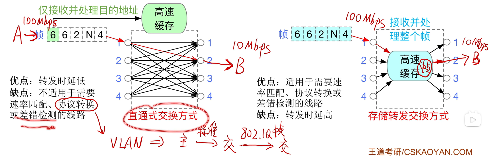

$$数据链路层设备$$

# 一、以太网交换机的特点

- 交换机 = 多端口 **网桥**

- 交换机工作在数据链路层，可以根据目的 MAC 地址转发帧。

# 二、以太网交换机的自学习功能

- 因为以太网交换机有自学习功能，所以支持即插即用。

- **交换表**：记录（MAC 地址，端口号）的对应关系。
  - 每个交换机内部都会维护一个。
  - **初始为空**。

- 交换机每 **收到一个帧**，就将 **发送方** 的（MAC 地址，端口号）更新到交换表。

- 如果 **不知道接收方在哪里**，就把帧 **广播到除入口外的其他端口**。
- 如果 **知道接收方在哪里**，就把帧 **精准转发** 至某个端口。

- 交换表中每个表项都有 **有效时间**，**过期表项自动作废**。
  - 以防某些节点拔线跑路。

# 三、以太网交换机的两种交换方式

{width=700}

## （一）直通交换方式

**直通交换方式**：**只检查帧的目的 MAC 地址**，以决定帧的转发端口。

- 优点：**转发时延低**。

- 缺点：不适用于需要速率匹配、协议转换或差错检测的线路。

## （二）存储转发交换方式

**存储转发交换**：**先把帧完整地接收到交换机内部的高速缓存中**，进行差错检测等必要处理，再根据交换表决定从哪个端口转发出去。

- 优点：适用于需要速率匹配、协议转换或差错检测的线路。

- 缺点：**转发时延高**。