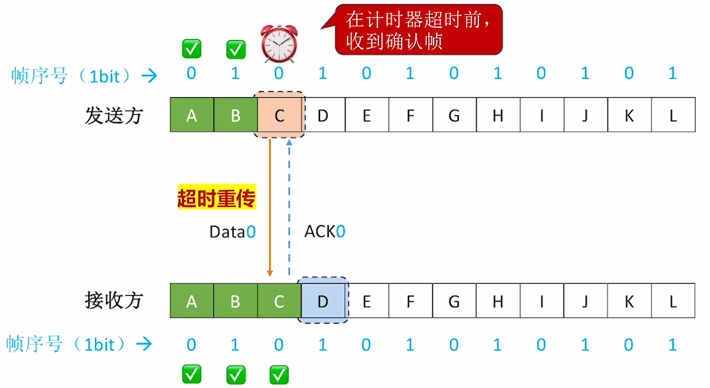
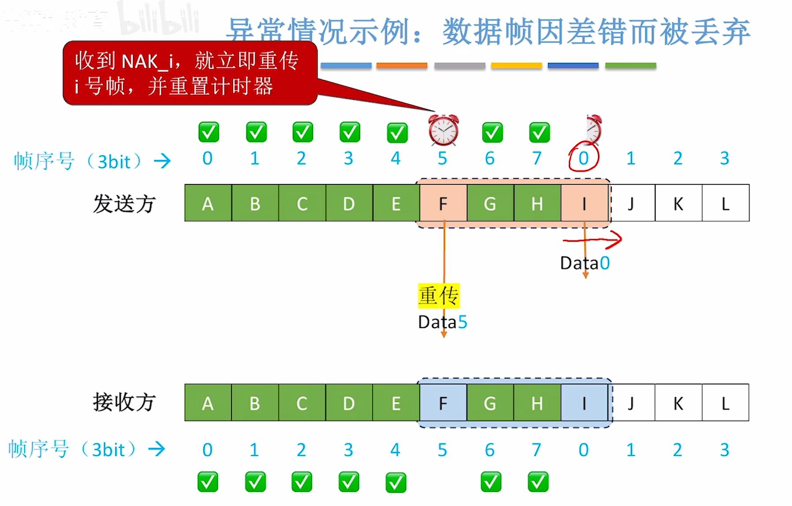

$$流量控制与可靠传输机制$$

**可靠传输**：发现并解决 **帧错**。

- **侦错** 包括：
  - **帧丢失**：如发送帧 1、2、3、4，收到帧 1、2、4。
  - **帧重复**：如发送帧 1、2、3、4，收到帧 1、2、3、3、4。
  - **帧失序**：如发送帧 1、2、3、4，收到帧 1、3、2、4。

**流量控制**：控制发送方发送帧的速率别特别快，让接收方来得及接受。

- 流量控制、可靠传输两种功能都可以基于滑动窗口机制来实现。

- 实现流量控制与可靠传输需要多种机制配合。
  - **滑动窗口机制**
    - **停止-等待协议（S-W）** 的发送窗口 = 1，接收窗口 = 1
    - **后退 N 协议（GBN）** 的发送窗口 > 1，接收窗口 = 1
    - **选择重传协议（SR）** 的发送窗口 > 1，接收窗口 > 1
  - **确认机制**
    - **确认帧 ACK_i**：若接收方收到 i 号帧，且没有检测出“差错”，需要给发送方返回确认帧 ACK_i。
    - **否认帧 NAK_i**：若接收方收到 i 号帧，但检测出 i 号帧有“差错”，需要丢弃该帧，并给发送方返回否认帧 NAK_i。
  - **重传机制**
    - **超时重传**：若发送方 **超时未接收到 ACK_i**，则重传 i 号帧。
    - **请求重传**：若发送方 **收到 NAK_i**，则重传 i 号帧。
  - **帧编号**
    - 为了支持以上机制正确运行，**至少** 需要用 **n bit** 给帧编号。
    - **要求：$W_T + W_R \leq 2^n$**
  - 注意：停止-等待协议（S-W）、后退 N 帧协议（GBN）、选择重传协议（SR）在 **四个方面** 有所不同。

# 一、滑动窗口机制

**发送窗口 $W_T$**：发送方当前允许发送的帧。
**接收窗口 $W_R$**：接收方当前允许接收的帧。

{width=600}

由接收方通过 **确认机制** 控制发送方的窗口向前滑动，从而实现 **流量控制**。

{width=600}

# 二、停止-等待协议（S-W）

## （一）滑动窗口机制

**发送窗口 = 1，接收窗口 = 1**

{width=700}

## （二）确认机制

**确认帧 ACK_i**：若接收方收到 i 号帧，且没有检测出“差错”，需要给发送方 **返回确认帧 ACK_i。**

{width=700}

## （三）重传机制

**超时重传**：若发送方 **超时未接收到 ACK_i**，则重传 i 号帧。

- 发出一个帧后，发送方需要启动“计时器”，若计时器超时，就自动重传。
- 数据帧可能因网络噪声等原因丢失。
- 超时重传后重置计时器，在计时器超时前，收到确认帧。

- **数据帧丢失**
  

  {width=700}
  

- **确认帧丢失**
  

  {width=700}
  

  - **如果没有“帧序号”，接收方无法判别“重复帧”。**
  - 由于接收窗口和发送窗口的距离不超过 1，因此 **用 1 bit 表示帧序号** 足矣。

- **数据帧有“差错”**
  

  {width=700}
  

- S-W 不存在“数据帧失序”问题。
  - 因为接收窗口大小为 1，因此接收方只会按顺序接收各个数据帧。

## （四）帧编号

**仅需 1 bit** 给帧“编号。

- **要求：$W_T + W_R \leq 2^n$**

# 三、后退 N 帧协议（GBN）

## （一）滑动窗口机制

**发送窗口 > 1，接收窗口 = 1**

{width=700}

## （二）确认机制

**确认帧 ACK_i**：若接收方收到 i 号帧，且没有检测出“差错”，需要给发送方返回确认帧 ACK_i。

{width=700}

## （三）重传机制

**超时重传**：若发送方 **超时未接收到 ACK_i**，则重传 i 号帧。

- 数据帧可能因通信故障而丢失，或检测出差错而丢弃。
- 重传帧的同时要重置计时器。
- 收到一个非法帧时，接收方会将此帧丢弃，并返回目前已接收的最后一个正确帧的 ACK_i，以提醒发送方“后退”回 $(i+1)\%2^n$ 号帧重新发送。
  - 非法帧：落在接收窗口之外的帧、检测出差错的帧。

- **缺点**：如果接收方接收帧的速度很慢，或在信道误码率很高的情况下，可能会导致发送方的发送进度经常需要“后退”，传输效率低下。

- **数据帧丢失**
  

  {width=700}
  {width=700}
  

- **确认帧丢失**
  

  {width=700}
  

## （四）帧编号

为了支持以上机制正确运行，**至少** 需要用 **n bit** 给帧编号。

- **要求：$W_T + W_R \leq 2^n$**

- 如果 **不满足 $W_T + W_R \leq 2^n$**，则：
  

  {width=700}
  

## （五）特殊规则

- 关于 **确认帧**：接收方可以 **积累确认**。
  - 即连续收到多个数据帧时，**可以仅返回最后一个帧的 ACK**。
  - ACK_i 表示接收方已收到 i 号帧及其之前的所有帧。

- 关于 **超时重传**：若发送方 **超时未收到 ACK_i**，则 **重传 i 号帧，及其之后的所有帧**。

# 四、选择重传协议（SR）

## （一）滑动窗口机制

**发送窗口 > 1，接收窗口 > 1**

**$W_R \leq W_T$**，即接收窗口不能大于发送窗口。

{width=700}

## （二）确认机制

**确认帧 ACK_i**：若接收方收到 i 号帧，且没有检测出“差错”，需要给发送方返回确认帧 ACK_i。

**否认帧 NAK_i**：若接收方收到 i 号帧，但检测出 i 号帧有“差错”，需要丢弃该帧，并给发送方返回否认帧 NAK_i。

- SR 协议不支持“累计确认”，必须一帧一确认。

- **SR 协议** 规定：接收方可以连续接收多个帧，但 **每个帧都需要返回 ACK**。

{width=700}

## （三）重传机制

**超时重传**：若发送方 **超时未接收到 ACK_i**，则重传 i 号帧。

- 即每个帧被发出时设置 **计时器**，如果 **超时未收到** 对应的 ACK，就 **重传** 这个帧。

- **数据帧丢失**
  

  {width=700}
  

- **数据帧出错**
  

  {width=700}
  {width=700}
  

- **确认帧丢失**
  - 确认帧丢失，触发超时重传。
  - 接收方收到重复帧（窗口外），发送确认帧。
  

  {width=700}
  {width=700}
  

## （四）帧编号

为了支持以上机制正确运行，**至少** 需要用 **n bit** 给帧编号。

- **要求：$W_T + W_R \leq 2^n$**

- 如果 **不满足 $W_T + W_R \leq 2^n$**，则：
  

  {width=700}
  

## （五）特殊规则

- **否认帧 NAK_i**：若接收方收到 i 号帧，但检测出 i 号帧有“差错”，需要丢弃该帧，并给发送方返回否认帧 NAK_i。

- **请求重传**：若发送方 **收到 NAK_i**，则重传 i 号帧。
  - 即：如果接收方收到一个有差错的帧，就 **将此帧丢弃**，并返回对应的 **否认帧 NAK_i**，主动请求发送方重传 i 号帧。

- **要求：$W_R \leq W_T$，即接收窗口不能大于发送窗口**。

# 五、三种协议的信道利用率分析

## （一）S-W 协议的信道利用率

{width=700}
{width=700}

## （二）GBN、SR 协议的信道利用率

- **GBN 协议 $W_R = 1$，SR 协议 $W_R > 1$**。因此，同样用 n bit 给帧编号，GBN 的发送窗口 $W_T$ 更大，因此 GBN 的信道利用率也会更高。

{width=700}
{width=700}

## （三）补充术语

- 术语使用上，**停止-等待协议不属于“滑动窗口协议”范畴**，**滑动窗口协议** 包括 **后退 N 帧协议（GBN）**、**选择重传协议（SR）**。

- **ARQ 协议（自动重传需求协议，Automatic Repeat Request）** 包含 **S-W、GBN、SR 三种协议**。

- **连续 ARQ 协议** 包含 **GBN、SR 两种协议**。