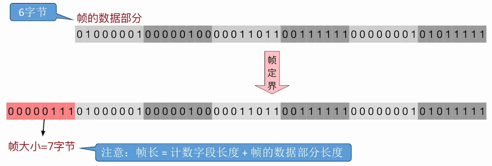
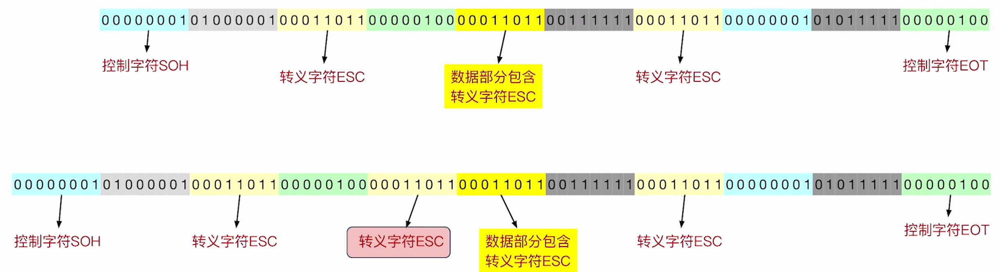
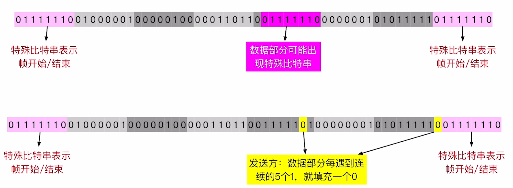
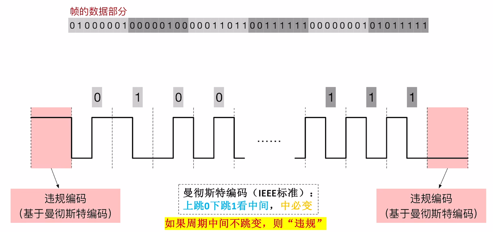

$$组帧$$

**封装成帧（组帧）** 的主要问题：
1. **帧定界**：如何让接收方能够确定帧的界限。

2. **透明传输**：接收方要能够去除“帧定界”的附加信息，把帧“恢复原貌”。

有四种组帧方法：**字符计数法**、**字节填充法**、**零比特填充法**、**违规编码法**。

# 一、字符计数法

{width=700}

**原理**：在每个帧开头，用一个 **定长计数字段** 表示帧长。

- 帧长 = 计数字段长度 + 帧的数据部分长度

- 最大缺点：任何一个计数字段出错，都会导致后续所有帧无法界定。

# 二、字节填充法

{width=700}

- **特殊字符**：
  - 标记 **帧开头** 的字符：**SOH**。
  - 标记 **帧结尾** 的字符：**EOT**。
  - **转义字符 ESC**

如果帧的数据部分包含特殊字符，则 **发送方** 需要 **在这些特殊字符前填充转义字符 ESC**（**接收方** 要做 **逆处理**）。

# 三、零比特填充法

{width=700}

原理：用特殊的比特串 **01111110** 标记 **帧开始、帧结尾**。

**发送方** 需要对帧的数据部分进行处理，**每当遇到连续 5 个 1，就填充一个 0**。
**接收方** 需要对帧的数据部分进行逆处理，**每当遇到连续 5 个 1，就删掉后面的 0**。

- HDLC 协议、PPP 协议的组帧使用的是零比特填充法。

# 四、违规编码法

{width=700}

原理：使用 **违规信号** 表示 **帧的开头、结尾**（这种方法需要物理层配合）。
- 如：采用曼彻斯特编码时，使用“中间不跳变”作为“违规信号”，标记帧的开头、结尾。