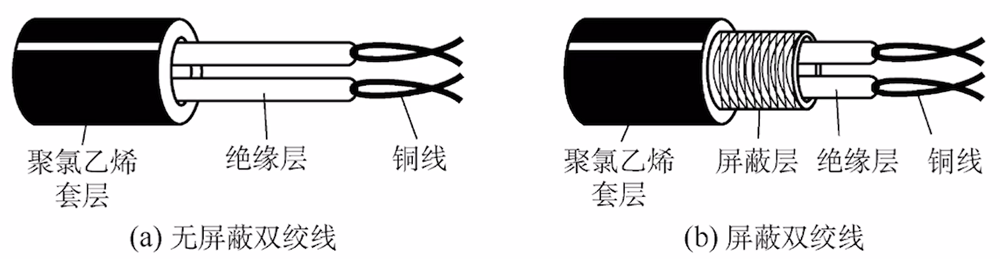
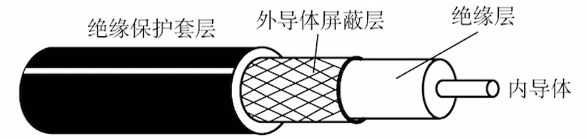
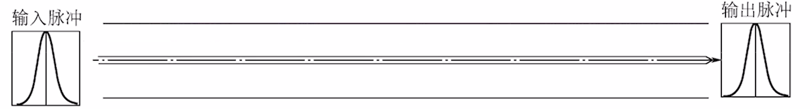
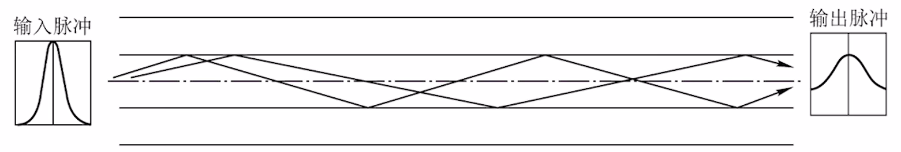
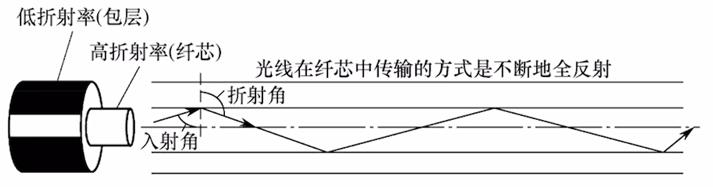

$$传输介质$$

# 一、常用的传输介质

## （一）导向型

**导向型传输介质** 的信号朝固定方式传播。

1. **双绞线（Twisted Pair）**
   - 主要构成：两根导线相互 **绞合** 而成。
     - 屏蔽双绞线（**STP，Shielded TP**）：**有屏蔽层**。
     - 非屏蔽双绞线（**UTP，Unshielded TP**）：**没有屏蔽层**。
     - **提高绞合度、增加屏蔽层**后，**抗电磁干扰能力强，信道噪声功率低。信道极限速率高**。
   - 抗干扰能力：较好。
   - 代表应用：近些年的局域网、早期电话线。
    

    {width=500}
    

2. **同轴电缆**
   - 主要构成：**内导体**（用于传输信号）、**外导体屏蔽层**（用于抗电磁干扰）。
     - **内导体越粗，电阻越低，传输过程中信号衰减越少，传输距离越长**。
   - 抗干扰能力：好。
     - 屏蔽层带来良好的抗干扰性。
   - 代表应用：早期局域网、早期有线电视。
    

    {width=500}
    

3. **光纤**
   - 主要构成：纤芯（高折射率）、包层（低折射率）。
     - 利用 **光的全反射** 特性，在纤芯内传输光脉冲信号。
   - 分类：
     - **单模光纤（SMF，Single-Mode Fiber）**：只有 **一条光线** 在一根光纤中传输，适合 **长距离** 传输，信号传输损耗小。
       - 纤芯更细，直径小于一个波长。
      

      {width=600}
      

      
     - **多模光纤（MMF，Multi-Mode Fiber）**：**多条光线** 在一根光纤中传输，适合 **近距离** 传输，远距离传输光信号容易失真。
       - 纤芯更粗，可同时传输多条光线。
      

      {width=600}
      

   - 抗干扰能力：非常好。
     - 光信号对电磁干扰不敏感。
   - 信号传输损耗小，长距离传输的中继器少。
   - 很细，很省布线空间。
    

    {width=500}
    

## （二）非导向型

**非导向型传输介质** 的信号朝四面八方传播。

1. **无线电波**
   - 特点：
     - **穿透力强**
     - **传输距离长**
     - **信号指向性弱**
   - 如：手机信号、WiFi。

2. **微波通信（短波通信）**
   - 特点：
     - **频率带宽高**
     - **信号指向性强**
     - **保密性差**（容易被窃听）
   - 如：卫星通信（卫星作为信号中继器，**传播时延较大**，可用近地卫星群解决）。

3. 其他：红外线通信、激光通信等。
   - 信号指向性强。

- 本质上都是用电磁波。
  - 电磁波公式：**$C = \lambda F$**
    - $C$：光速
    - $\lambda$：波长。
    - $F$：频率。
  - 电磁波频率、波长呈反比关系。
  - **频率越高，数据传输能力越强**。
  - **波长越短**，“信号 **指向性**” **越强**，信号越趋于直线传播。
  - 波长越长，“绕射性”越好，也就是信号“穿墙”能力越强。

- **长波** 更适合长距离、非直线通信。
- **短波** 更适合短距离、高速通信，若用于长距离通信需建立中继站。
- **短波** 信号指向性强，要求信号接收器“对准”信号源。

## （三）以太网对有限传输介质的命名规则

**速度 + Base + 介质信息**
- Baseband（基带传输）：传输数字信号（采用曼彻斯特编码）。
  - 如：
    - **10Base5**：**10Mbps，同轴电缆**，最远传输距离 500m。
    - **10Base2：10Mbps，同轴电缆**，最远传输距离 200m。
    - **10BaseF\*：10Mbps，光纤**。* 可以是其他信息，如 10BaseFL、10BaseFB、10BaseFP。
    - **10BaseT\*：10Mbps，双绞线**。* 可以是其他信息，如 10BaseT1S、10BaseT1L。

# 二、物理层接口的特性

1. **机械特性**：接口所用接线器的形状和尺寸、引脚数目和排列、固定和锁定装置等。

2. **电气特性**：在接口电缆的各条线上出现的电压的范围、传输速率、距离限制等。

3. **功能特性**：某条线上出现的某一电平的电压的意义。

4. **过程特性（规程特性）**：对于不同功能的各种可能事件的出现顺序。