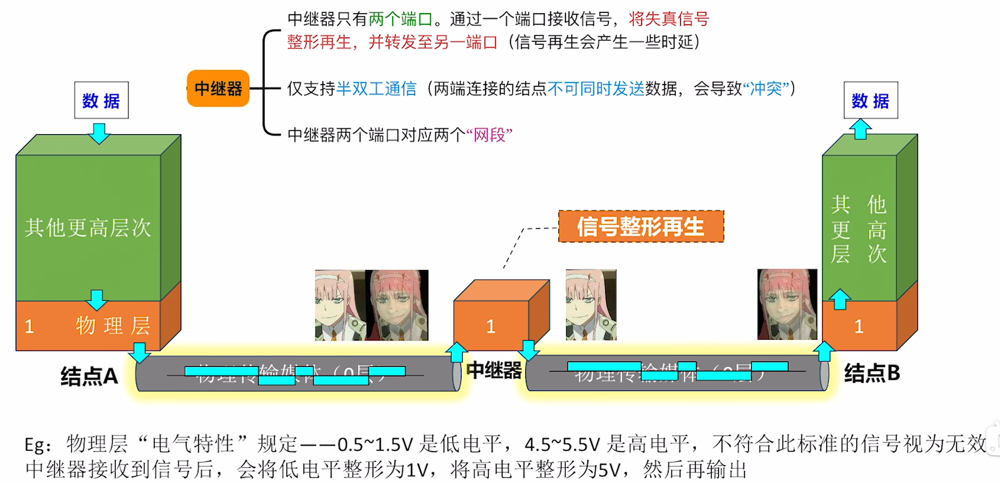
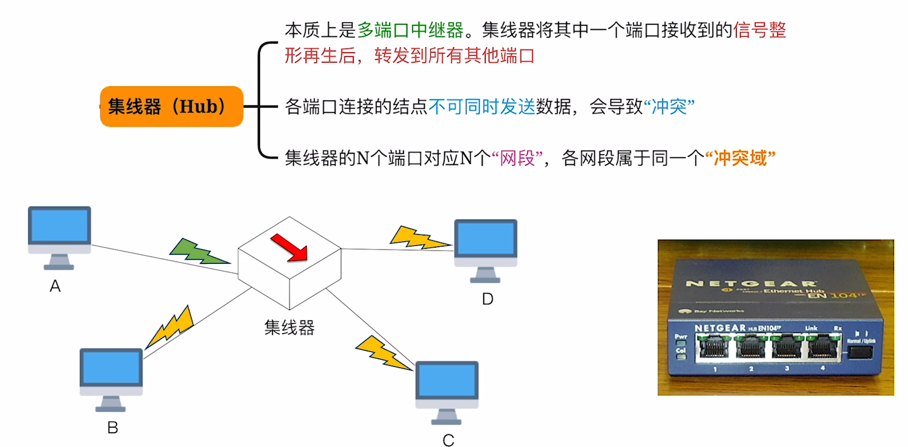

$$物理层设备$$

# 一、中继器（Repeater）

若传输距离太长，数字信号会失真。

{width=700}

- 集线器、中继器 **不能“无限串联”**。
  - 10Base5 的 5-4-3 原则：使用集线器（中继器）连接 10Base5 网段时，最多只能串联 5 个网段，使用 4 台集线器（中继器），只有 3 个网段可以挂接计算机。

# 二、集线器（Hub）

{width=700}

- **冲突域（碰撞域）**：**如果两台主机同时发送数据会导致“冲突”，则这两台主机处于同一个“冲突域”**。

- **处于同一冲突域的主机在发送数据前需要进行“信道争用”。**

- **集线器不能“隔离”冲突域**。
- **以太网交换机可以“隔离”冲突域**。

- **集线器** 连接的网络，**物理上是星形拓扑，逻辑上是总线形拓扑**。
  - 数据“广播式”传输，存在 **信道争用** 问题。

- 集线器连接的各网段 **共享带宽**。

- 集线器可以连接不同的传输介质，因此两个网段的物理层接口特性可以不同（即集线器连接的网段，物理层协议可以不同）。

- 集线器如果连接了速率不同的网段，会导致所有网段 **速率向下兼容**。