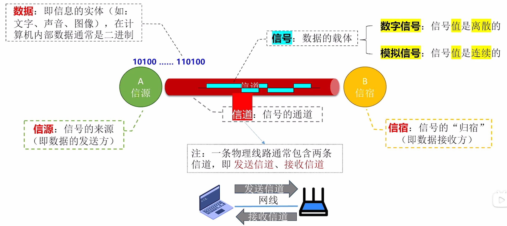
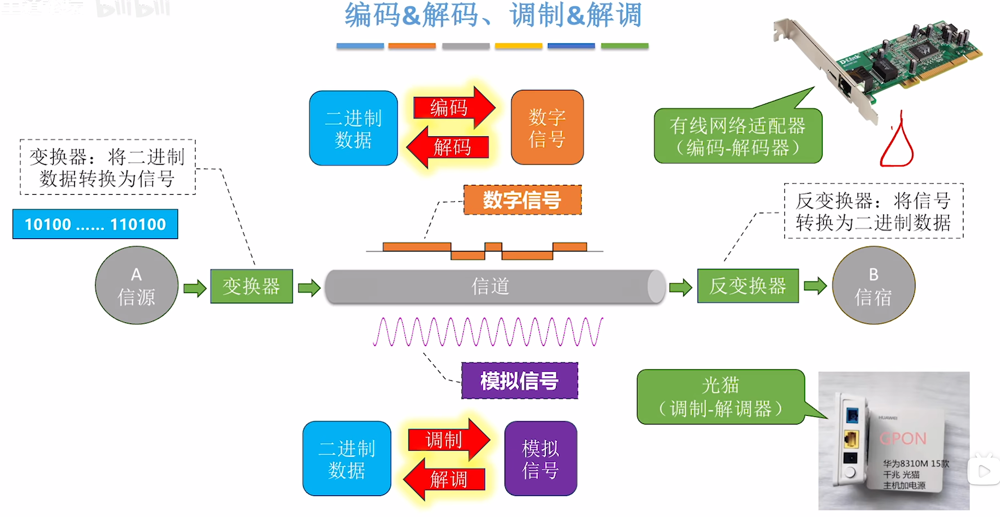
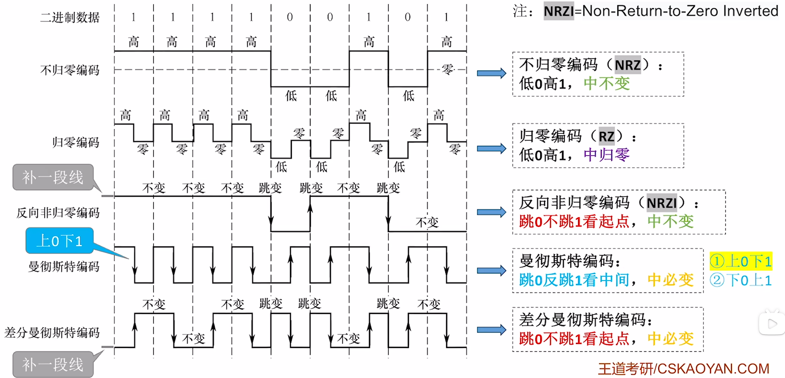
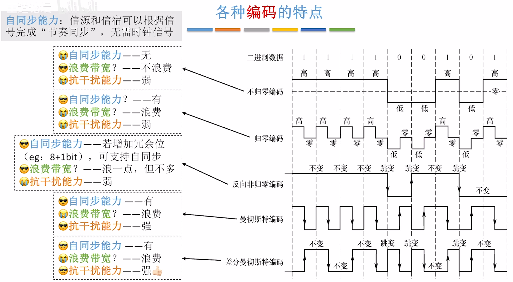
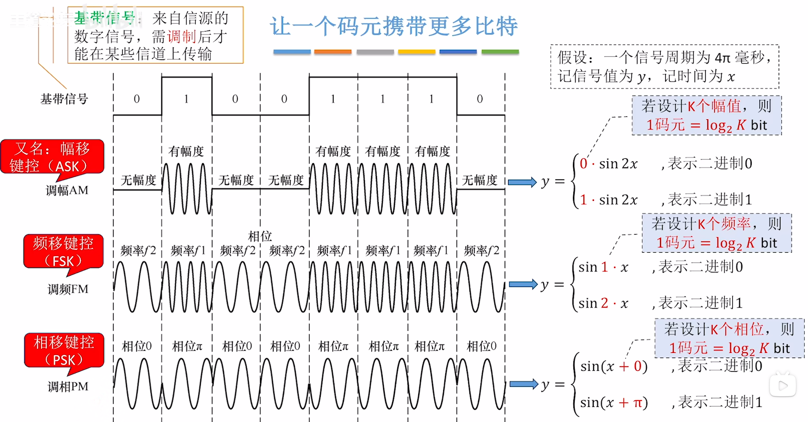
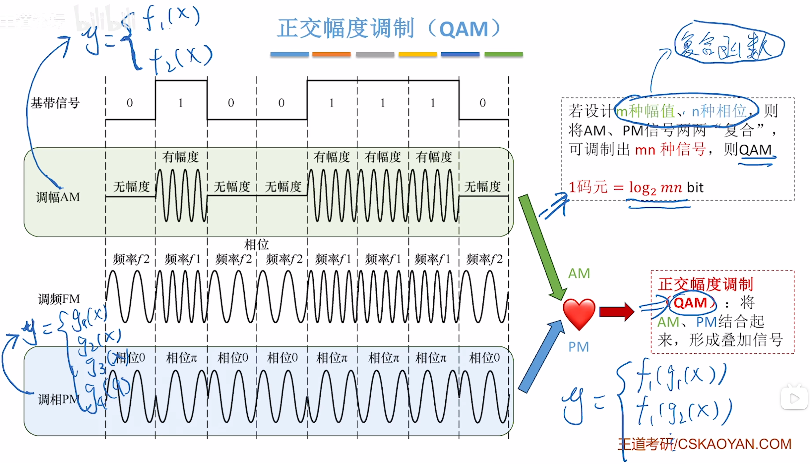
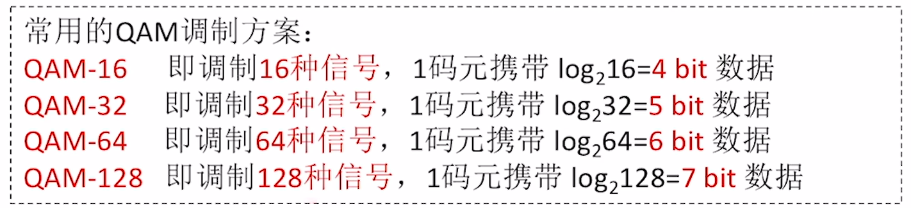

$$通信基础$$

# 一、基本概念

{width=700}

1. **信源**：信号的来源。（数据的发送方）

2. **信宿**：信号的“归宿”。（数据接收方）

3. **数据**：信息的实体。（如：文字、声音、图像）
   - 在计算机内部数据通常是二进制。

4. **信道**：信号的通道。
   - 一条物理线路通常包含两条信道，即 **发送信道**、**接收信道**。
   - 若传输信号为数字信号，则为 **数字信道**。
   - 若传输信号为模拟信号，则为 **模拟信道**。

5. **信号**：数据的载体。
   - **数字信号**：信号 **值** 是 **离散** 的。
   - **模拟信号**：信号 **值** 是 **连续** 的。

6. **码元**：每一个信号就是一个码元。
   - 一个码元（一个信号）可能有 4 种状态，则称其为 **4 进制码元**（一个码元携带 2 bit 数据）。
   - 一个码元（一个信号）可能有 8 种状态，则称其为 **8 进制码元**（一个码元携带 3 bit 数据）。
   - 一个码元（一个信号）可能有 16 种状态，则称其为 **16 进制码元**（一个码元携带 4 bit 数据）。

7. **码元宽度**：信号周期。

- **码元与比特的关系**：如果一个 **周期** 内可能出现 **K 种信号**，则：**$1 码元 = log_2K（bit）$**

8. **速率**：数据传输速率，表示单位时间内传输的数据量。有两种描述形式：
   - **波特率**：每秒传输几个码元。
     - 单位：**码元/秒**、**波特**（Baud）
   - **比特率**：每秒传输几个比特。
     - 单位：bit/s，b/s，bps
   - 注意：若一个码元携带 n bit 的信息量，则波特率 M Baud 对应的比特率为 Mn b/s。

9. **噪声**：对信道产生干扰，影响信道的数据传输效率。

# 二、信道的极限容量

## （一）奈奎斯特定理（奈氏准则）
**奈奎斯特定理（奈氏准则）**：对于一个 **理想低通信道（没有噪声、带宽有限的信道）**，**$极限波特率 = 2W$**（单位：波特，码元/秒）

- **W** 为信道的频率带宽（单位：Hz）。

- **$极限比特率 = 2W log_2K$**（b/s）

- 如果波特率太高，会导致 **码间串扰**，即接收方无法识别码元。

- 带宽越大，信道传输码元的能力越强。

- **奈奎斯特定理并未对一个码元最多可以携带多少比特做出解释**。

## （二）香农定理

**香农定理**：对于一个 **有噪声、带宽有限** 的信道，**$极限比特率 = W log_2{(1 + {S \over N})}$**（单位：**b/s**）

- **W** 为信道的频率带宽（单位：Hz）。
- **$S \over N$** 为 **信噪比**。
  - **$信噪比 = {S \over N} = {信号的功率 \over 噪声的功率}$**
  - 信噪比越高，噪声对数据传输的影响越小。
  - 信噪比可以采用 **无单位记法**，也可以用 **dB（分贝）** 为单位表示。
    - **$信噪比 = 10 log_{10}{S \over N}$**（单位：dB，分贝）
  - **注意**：使用香农定理计算信道的极限比特率时，**信噪比** 应采用 **无单位记法**。

- 提升信道带宽、加强信号功率、降低噪声功率，都可以提高信道的极限比特率。

- **结合奈奎斯特定理，可知，在带宽、信噪比确定的信道上，一个码元可以携带的比特数是有上限的**。

# 三、编码与调制

## （一）编码与解码、调制与解调的概念

{width=700}

## （二）常用的编码方法

{width=700}

- 归零是为了统一时钟节奏。
- 中变是为了统一时钟节奏，提高抗干扰能力。

**注意**：**以太网默认使用曼彻斯特编码。**

- 各种编码的 **特点**：
    

    {width=700}
    

## （三）常用的调制方法

{width=700}

{width=700}

{width=700}

