$$IPv4$$

**IP 协议（Internet Protocol，网际协议）是互联网的核心**。

**ARP 协议** 用于查询同一网络中的 <主机 IP 地址，MAC 地址> 之间的映射关系。

**ICMP 协议** 用于网络层实体之间相互通知 **异常事件**。

**IGMP 协议** 用于实现 IP 组播。

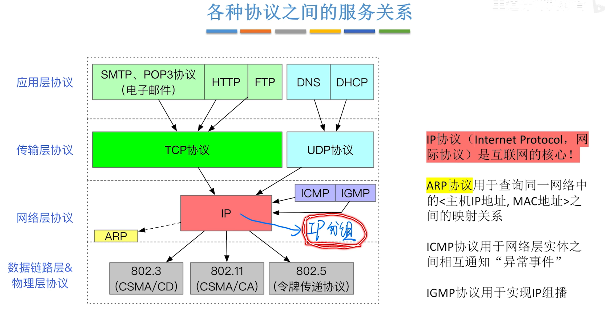{width=700}

# 一、IPv4 分组

## （一）IP 数据报（IP分组）的格式

- 结构：**<首部 + 数据部分>**
  - **首部** 固定部分 20B，可变部分 0~40B。

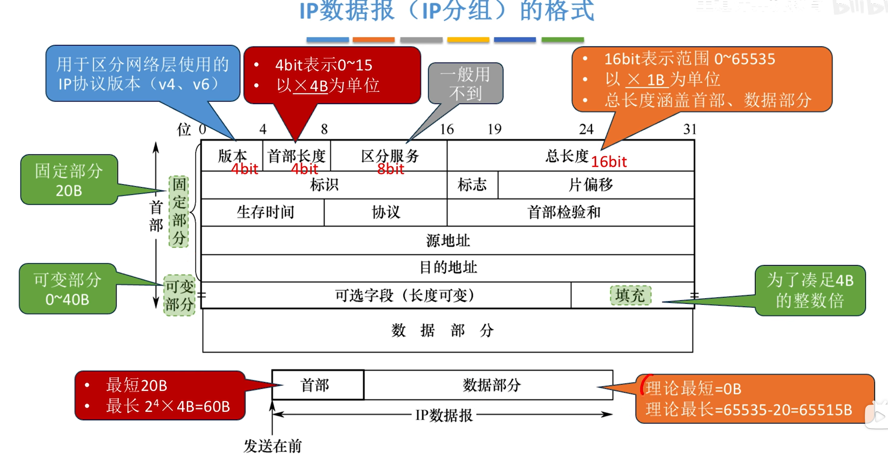{width=700}

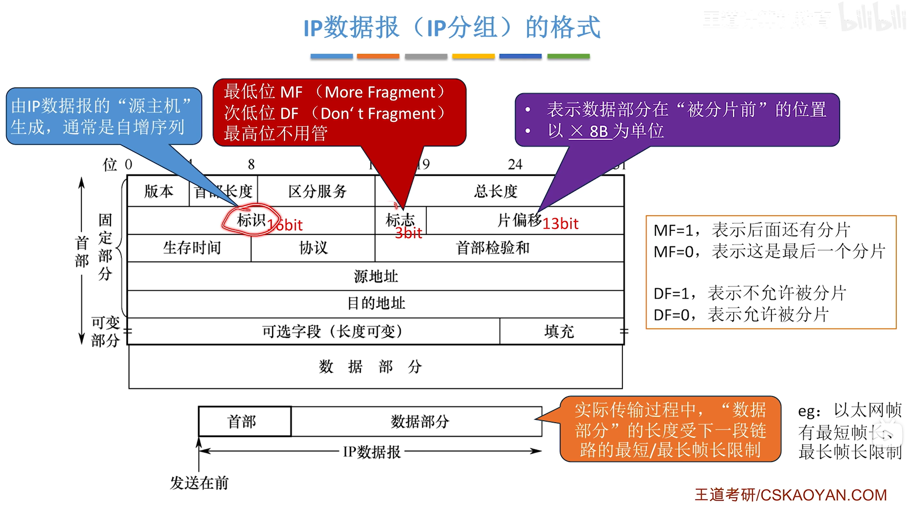{width=700}

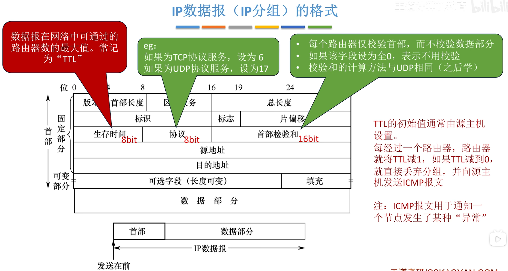{width=700}

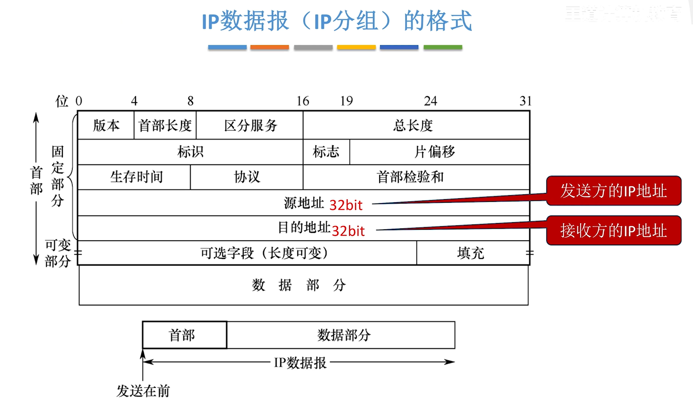{width=700}

- 格式不用记忆，只需记住每个字段的含义。

## （二）IP 数据报的分片

- 实际传输过程中，数据部分的长度受下一段链路的最短/最长帧长限制。

- **最大传送单元（MTU）**：**一个链路层数据帧** 能承载的 **最大数据量**。
  - 如：以太网的 MTU = 1500B

- **如果一个 IP 数据报的总长度超出了下一段链路的 MTU，就需要分片**。
- 每个分片都是一个可以被单独转发的 IP 数据报，都包含首部。

**注意**：
- IP 数据报的 **分片** 可能在 **源主机、或任何一个路由器** 中发生。

- 只有 **目的主机** 才会对分片进行 **重组**。

- 各分片有可能乱序到达目的主机。

- 由于首部的片偏移字段是以 **$\times$ 8B** 为单位，因此，**除了最后一个分片外，其他每个分片的数据部分必须是 8B 的整数倍**。

# 二、IPv4 地址

**IP 地址** 是给连接到互联网上的每台主机（或路由器）的每个接口，分配的一个在全球范围内唯一的 32 位标识符。

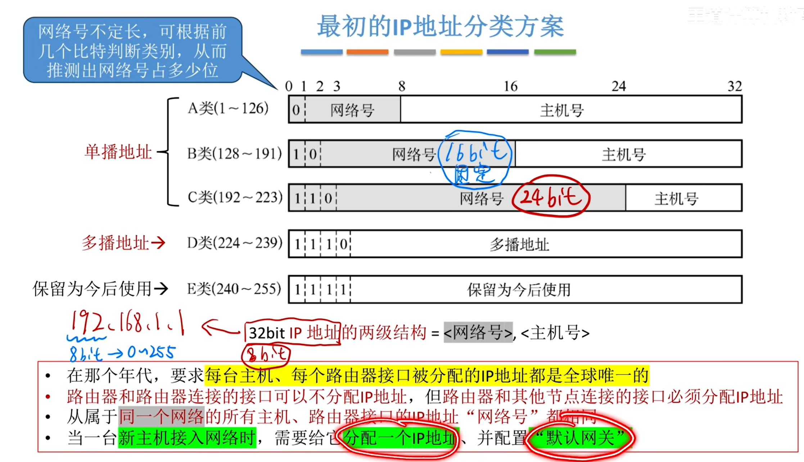{width=700}

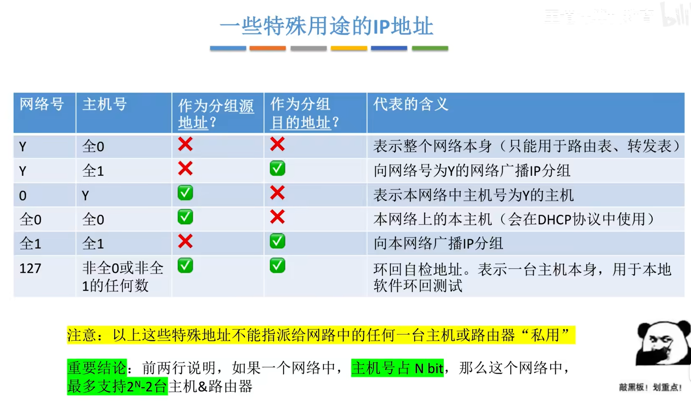{width=700}

# 三、子网划分与子网掩码

## （一）子网划分

**原理**：若某单位租用了一个 IP 地址段，假设原本 **主机号** 占 **n bit**，那么可以将前 **k bit** 抠出来作为 **子网号**，用剩余的 **n-k bit** 作为 **主机号**，这样就能划分出 $2^k$ 个子网（**每个子网包含的 IP 地址块大小相等**）。

- 子网划分前，IP 地址为两级结构 = **<网络号，主机号>**

- 子网划分后，IP 地址为三级结构 = **<网络号，子网号，主机号>**

**注意**：每个子网地址中，**主机号不能分配为全 0/全 1**。（全 0 表示子网本身，全 1 为子网广播地址）

## （二）子网掩码

- 作用：
  - 用子网掩码、IP 地址 **逐位与**，算出 **<网络号，子网号>**（可和称为 **网络前缀**）。
  - 只有 **网络前缀** 相同的 IP 地址，才归属于同一个网络（或子网）。
  - 就是用来判断是否属于同一个网络（子网）。

- 注意：
  - 如果一个网络内部进行了子网划分，那么这个网络中的 **每台主机、每个路由器接口** 都需要配置 **IP 地址、默认网关、子网掩码**。
  - 如果一台路由器支持子网划分技术，那么在它的转发表中，需要包含 <目的网络号，子网掩码，转发接口>。

- 子网掩码的 **CIDR 记法**：
  

  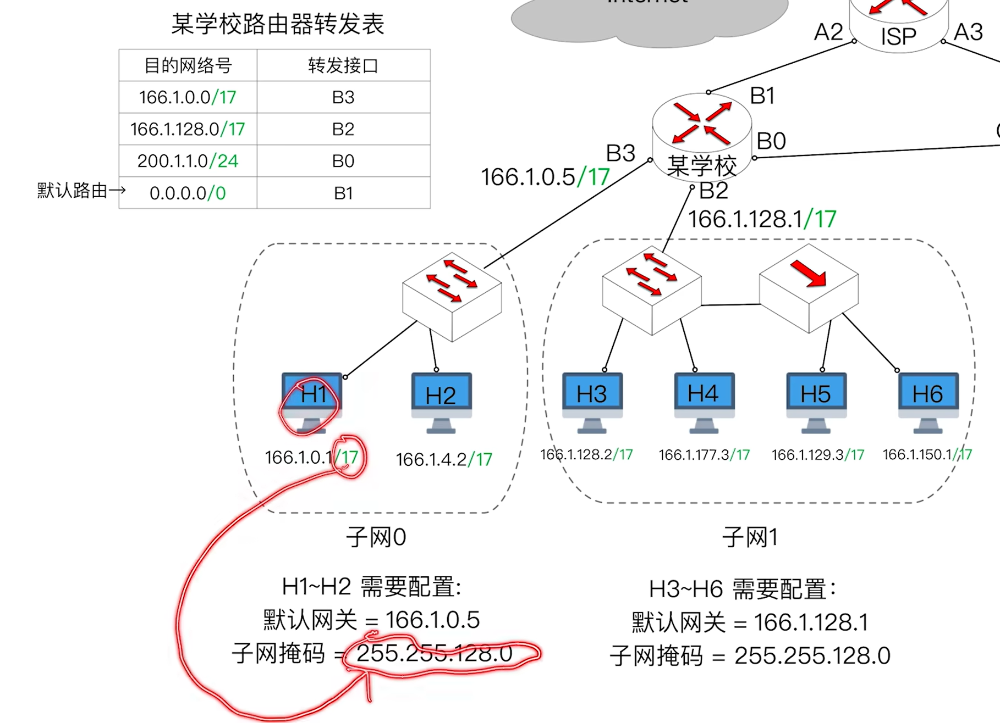{width=700}
  

## （三）默认子网掩码

如果一个传统网络（A/B/C 类）内部没有进行子网划分，那么可以将对应次网络的转发表项设置为 **默认子网掩码**。

- A 类默认：255.0.0.0
- B 类默认：255.255.0.0
- C 类默认：255.255.255.0

## （四）默认路由

默认路由（默认转发表项）设置：<目的网络号全 0，子网掩码全 0>

- 在路由器转发表中，如果所有表项都不匹配，那么将从 **默认路由** 转发出去。

## （五）主机发送 IP 数据报的过程

1. 判断目的主机和本机是否属于同一个网络。
   - 先检查本机 IP 地址和目的 IP 地址的 **网络前缀** 是否相同（需要用本机配置的 **子网掩码“逐位与”**）。
   - 若 **网络前缀相同**，说明目的主机和本机属于同一个网络；若 **网络前缀不同**，说明不属于同一网络。

2. 将 IP 数据报封装成 MAC 帧并发送到链路上。
   - 如果 **目的主机与本机属于同一个网络**，就通过 ARP 协议找到 **目的主机** 的 MAC 地址，再 **将 IP 数据报封装成帧，并将帧发送给目的主机**。
   - 如果 **目的主机与本机不属于同一个网络**，就通过 ARP 协议找到 **默认网关** 的 MAC 地址，再 **将 IP 数据报封装成帧，并将帧发送给默认网关**。

## （六）路由器转发一个 IP 数据报的过程

1. 路由器的某个接口收到一个 IP 数据报。

2. 对 IP 数据报首部进行校验，并从中找到 **目的 IP 地址**。

3. 查转发表。
   - 转发表的表项包含 **<目的网络号，子网掩码，转发接口>**。
   - 检查 **目的 IP 地址** 与每个表项是否匹配（将 **目的 IP 地址**、**子网掩码** 逐位与，匹配表项中的 **目的网络号**）。
   - 注意：至少 **默认路由** 表项一定是可以匹配成功的。

4. 转发。
   - 根据查转发表的结果，将 IP 数据报从匹配的接口转发出去。
   - 注意：如果匹配的 **转发接口** 和该 IP 数据报的入口相同，就不用再把 IP 数据报转发回去。

# 四、无分类编址 CIDR

传统的 IP 地址分配方案中 IP 地址资源分配不灵活，利用率低，有限的 IP 地址资源将很快耗尽。

**无分类域间路由选择（CIDR）**：是在变长子网掩码的基础上，提出的一种消除传统 A、B、C 类地址及划分子网的概念。

- 若采用 无分类编址 CIDR，IP 地址块分配更灵活，利用率更高，一定程度上缓解了 IP 地址耗尽。

- IP 地址 = {<网络前缀>，<主机号>}
  - 网络前缀不定长。

- CIDR 记法：128. 14. 32. 153/30，表示在这个 IP 地址中，网络前缀占 30 bit，主机号 2 bit。

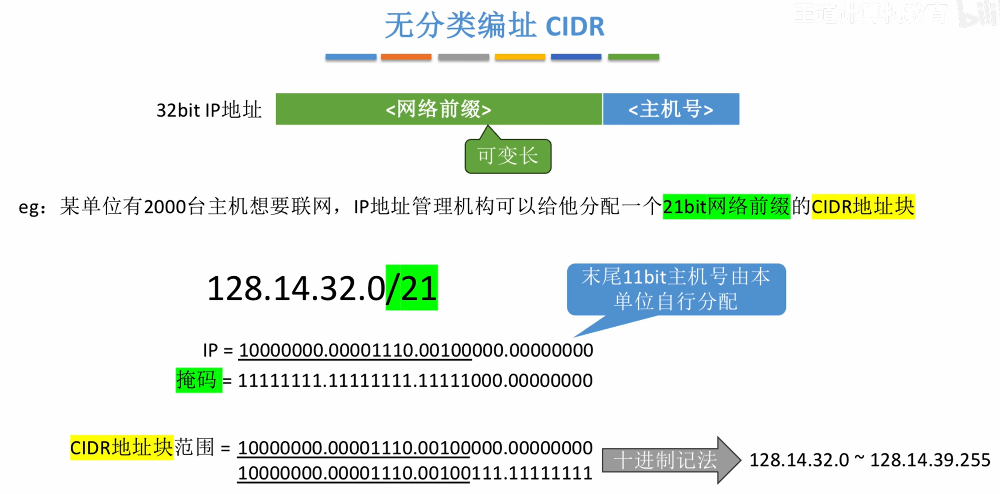{width=700}

- 一个单位获得 CIDR 地址块后，可以把它划分为多个子网。
  - **定长子网划分**：在一个 CIDR 地址块中，把 **n bit 主机号** 的 **前 k bit** 抠出来作为 **定长子网号**，这样就能划分出 **$2^k$ 个定长子网**（每个子网包含的 IP 地址块大小相等，都 **包含 $2^{n-k}$ 个 IP 地址**）。
    - 与传统的子网划分技术同理。
    - **缺点：每个子网都一样大，不够灵活，IP 地址利用率低，浪费有限的 IP 地址资源）。**
  - **变长子网划分**：在一个 CIDR 地址块中，划分子网时，**子网号长度不固定**（每个子网包含的 IP 地址块大小不同）。
    - 子网划分更灵活。
  - **注意：在每个子网中，主机号全 0、全 1 的 IP 地址不能分配给特定节点私用。**
  

  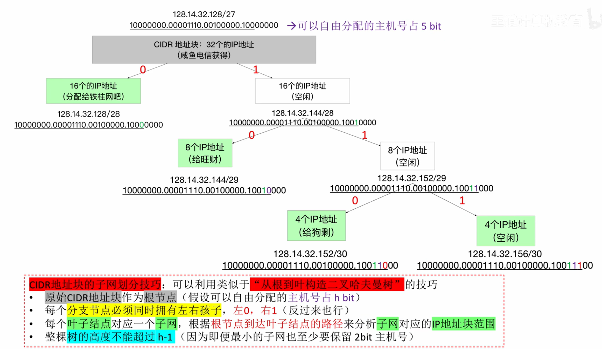{width=700}
  

- 变长子网划分例题：
  

  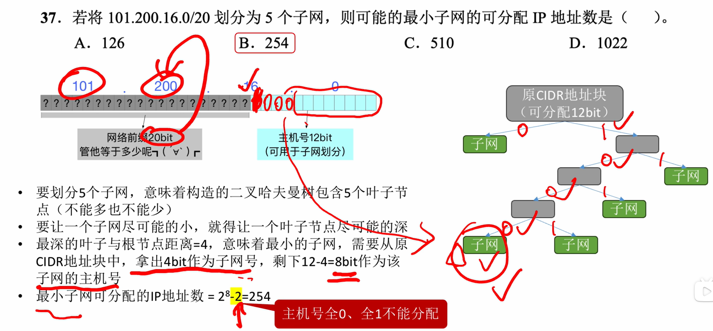{width=700}
  

# 五、路由聚合

**路由聚合（路由超网）**：对一个路由转发表，如果几条路由表项的 **转发接口相同**，**部分网络前缀也相同**，那么可以 **将这几条路由表项聚合为一条**。

- 路由聚合 **可以减少路由表的大小，提高查表速度**。

- 路由聚合 **可能会引入额外的无效地址**。

- **最长前缀匹配原则**：
  - 采用 CIDR 技术后，由于 **路由聚合**，一个 IP 地址在转发表中可能会匹配多个表项，此时应使用 **最长前缀匹配原则**。
  

  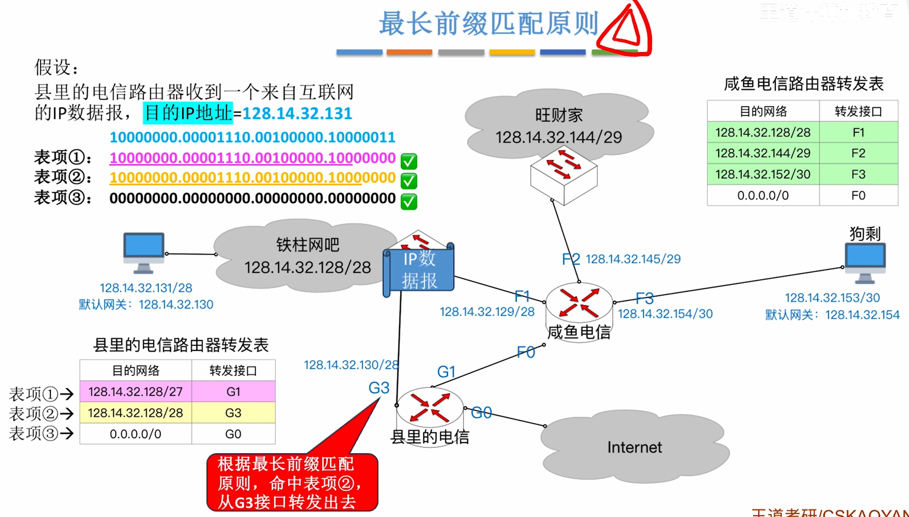{width=700}
  

# 六、网络地址转换 NAT

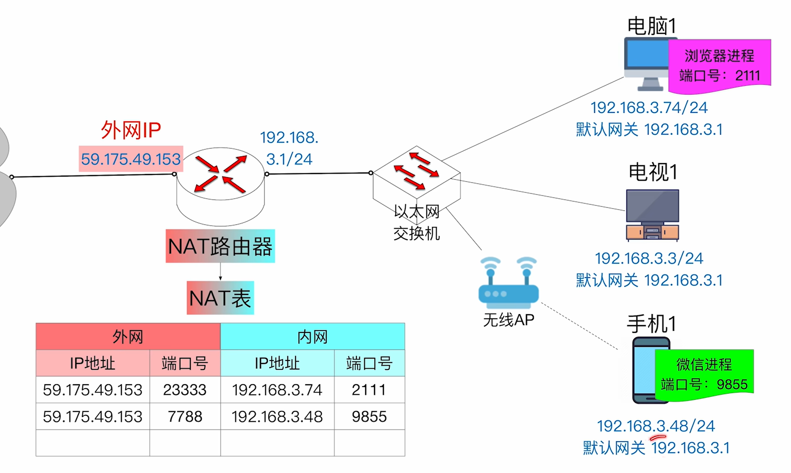{width=700}

## （一）私有 IP 地址（内网 IP）

- 只允许分配给局域网内部的节点，**不允许分配给互联网上的节点**：
  - **10**.0.0.0 ~ **10**.255.255.255
  - **172.16**.0.0 ~ **172.31**.255.255
  - **192.168**.0.0 ~ **192.168**.255.255

- 每个局域网内部都可以自行分配这些私有 IP 地址。

- **私有 IP 地址** 是可复用的，**只要求局域网内唯一，不要求全球唯一**。

## （二）全球 IP 地址（外网 IP）

外网 IP 是一个局域网与外界通信时所需使用的 IP 地址。

- 全球 IP 地址通常由 ISP 提供，**全球唯一**。

## （三）NAT 路由器

NAT 路由器的 **作用**：**转发 IP 数据报时，进行内网 IP、外网 IP 的相互转换**。

- **NAT 表**：记录地址转换关系。
  - **<内网 IP：端口号 $\Leftrightarrow$ 外网 IP：端口号>**

- 一个 IP 数据报
  - 从内网转发到外网，会更改源 IP 地址、源端口号。
  - 从外网转发到内网，会更改目的 IP 地址、目的端口号。

- **NAT 路由器包含传输层的功能**（因为端口号时传输层的概念）

- **IP 地址 + 端口号 = 一个特定的进程**

- **网络层** 实现了 **主机到主机** 的通信。网络层在 IP 数据报的首部，指明 **源 IP 地址**、**目的 IP 地址**。

- **传输层** 实现了 **端到端（进程到进程）** 的通信。传输层在 TCP（或 UDP）报文段的首部，指明 **源端口**、**目的端口**。

- 注意：
  - 普通路由器转发 IP 数据报时，不会改变源 IP 地址、目的 IP 地址。
  - 普通路由器仅包含网络层及以下的功能。

# 七、地址解析协议 ARP

**ARP 协议** 用于查询同一网络中的 <IP 地址，MAC 地址> 之间的映射关系。

- ARP 协议的 **作用**：在 **一个局域网内部**，可以 **通过 ARP 协议查询到一个 IP 地址对应的 MAC 地址**。

- ARP 表（ARP 缓存）：
  - 记录 **<IP 地址 $\Leftrightarrow$ MAC 地址>** 之间的映射关系。
  - 是一个数据结构（每台主机、每台路由器都有自己的 ARP 表）。
  - 需要定期更新 ARP 表项。

- **过程**：
  1. **ARP 请求分组**：
     - 内容：
       - 我是谁？：我的 IP 地址是 X，我的 MAC 地址是 Y。
       - 我想找谁？：我想找的这个家伙，IP 地址是 Z。
     - **ARP 请求分组** 封装进 MAC 帧（帧目的地址 = 全 1,源地址 = Y）
       - 是 **广播帧**。
  2. **ARP 相应分组**：
     - 内容：你好，我就是你要找的那个靓仔，我的 IP 地址是 Z，我的 MAC 地址是 V。
     - **ARP 响应分组** 封装进 MAC 帧（帧目的地址 = Y，源地址 = V）
       - 是 **单播帧**。

- 注意：
  - **MAC 地址（48 bit）**，是网络适配器出厂时分配好的，全球唯一。
  - 一台主机至少有一个网络适配器（网线插口背后的芯片），因此 **主机至少有一个 MAC 地址**。
  - 一台路由器有多个转发接口，每个接口背后都是一个网络适配器，因此 **路由器有多个 MAC 地址**。

# 八、动态主机配置协议 DHCP

## （一）基本概念

**动态主机配置协议（DHCP 协议）** 的 **作用**：**给刚接入网络的主机动态分配 IP 地址、配置默认网关、子网掩码。**

- **DHCP 使用客户/服务器模型（C/S）**：
  - DHCP 客户：就是新接入网络的主机（希望获得 IP 地址等配置）。
  - DHCP 服务器：就是负责分配 IP 地址的那台主机，管理一系列 IP 地址池。
    - 在一个大型网络内可以由多台 DHCP 服务器。
    - 注意：在家庭网络中，通常由家庭路由器兼职DHCP 服务器。

- **DHCP 是应用层协议，使用传输层中 UDP 协议提供的服务**：客户 UDP 端口号 = 68、服务器 UDP 端口号 = 67。

## （二）工作过程

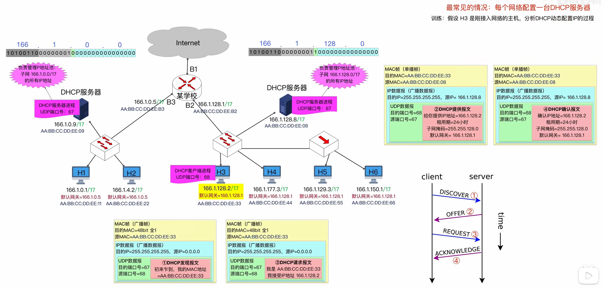{width=700}

1. **客户 $\rightarrow$ 服务器：DHCP 发现报文**：
   - 携带信息：客户主机的 MAC 地址（还可以提出对 IP 地址租用期的要求）。
   - 网络层：**源 IP 地址 = 0.0.0.0**，**目的 IP 地址 = 255.255.255.255（广播 IP 数据报）**
   - 链路层：源 MAC = 客户的 MAC 地址，目的 MAC = 全 1（**广播帧**）

2. **服务器 $\rightarrow$ 客户：DHCP 提供报文**：
   - 携带信息：给客户分配的 IP 地址、**租用期**、子网掩码、默认网关。
   - 网络层：**源 IP = DHCP 服务器的 IP 地址**，**目的 IP =255.255.255.255（广播 IP 数据报）**
   - 链路层：源 MAC = 服务器的 MAC 地址，目的 MAC = 客户的 MAC 地址（**单播帧**）

3. **客户 $\rightarrow$ 服务器：DHCP请求报文**：
   - 携带信息：客户机确认要使用的 IP 地址。
   - 网络层：**源 IP = 0.0.0.0**，**目的 IP = 255.255.255.255（广播 IP 数据报）**
   - 链路层：源 MAC = 客户的 MAC 地址，目的 MAC = 全 1（**广播帧**）

4. **服务器 $\rightarrow$ 客户**：
   - 携带信息：与“DHCP 提供报文”的类似。
   - 网络层：**源 IP = DHCP 服务器的 IP 地址**，**目的 IP = 255.255.255.255（广播 IP 数据报）**
   - 链路层：源 MAC = 服务器的 MAC 地址，目的 MAC = 客户的 MAC 地址（**单播帧**）

# 九、网际控制报文协议 ICMP

- **ICMP 属于网络层，ICMP 报文封装在 IP 数据报中**。
  - **IP 协议为 ICMP 协议提供服务**。

- ICMP 可以让主机或路由器相互报告网络中发生的差错和异常情况。

- **ICMP 报文的常见类型**：
  - **差错报告报文**：
    - **终点不可达**：
      - 路由器告诉发送方：目的 IP 地址不可到达（**道路不通**）。
      - 目的主机告诉发送方：目的端口号不存在，我这边没有对应进程。
    - **时间超过**：
      - 路由器告诉发送方：你的 IP 数据报到我这里 TTL = 0,被我丢了（**路程太远**）。
      - 目的主机告诉发送方：你的 IP 数据报被分片了，规定时间内没到齐，我已全部丢弃。
    - **参数问题**：
      - 告诉发送方：你的 IP 数据报首部参数不合法、或首部校验出错。
    - **改变路由（重定向）**：
      - 路由器告诉发送方：对于这个目的网络，下次你让另一台路由器帮你转发，路径会更短。
    - 源点抑制（2012 年后已废弃）：
      - 告诉发送方：网络方式拥塞，丢包了，求求你发慢点。
  - **询问报文**：
    - **回送请求（Echo Request）**：
      - A $\rightarrow$ B：在吗？回答我！
    - **回送回答（Echo Reply）**：
      - B $\rightarrow$ A：在！
    - **时间戳请求（Timestamp Request）**：
      - A $\rightarrow$ B：我这边现在的时间是 xxxx，你那边几点了？
    - **时间戳回答（Timestamp Reply）**：
      - B $\rightarrow$ A：我收到 **请求** 的时间是 yyyy，我发出 **回答** 的时间是 zzzz。

- **不必反馈 ICMP 差错报告报文** 的情况：
  - 若携带 ICMP 差错报告报文的 IP 数据报出错，不再反馈 ICMP 出错。
  - 若 IP 数据报被分片，则无论几个分片出错，都只反馈一次 ICMP 差错。
  - 若 IP 数据报的目的地址为多播地址，不反馈 ICMP 出错。
  - 若 IP 数据报的源地址为特殊地址（如：127.x.x.x、0.0.0.0），则即便发送 IP 数据报异常也不反馈 ICMP 差错。

- ICMP 的典型应用：
  - **ping** 基于 **回送请求报文、回送回答报文** 实现功能。
    - 用来测试两台主机之间的连通性。
  - **traceroute（tracert）** 基于 **时间超过报文** 实现功能。
    - 用来跟踪分组经过的路由。