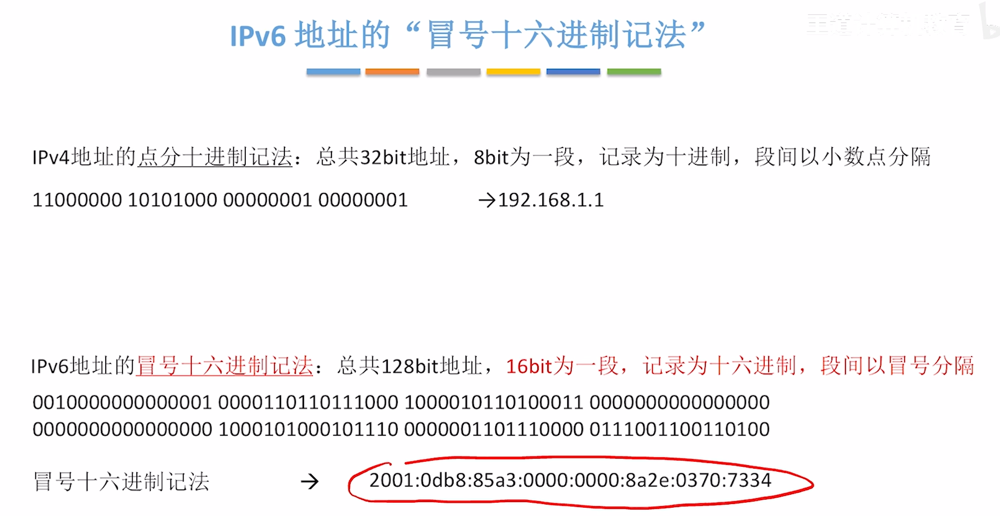
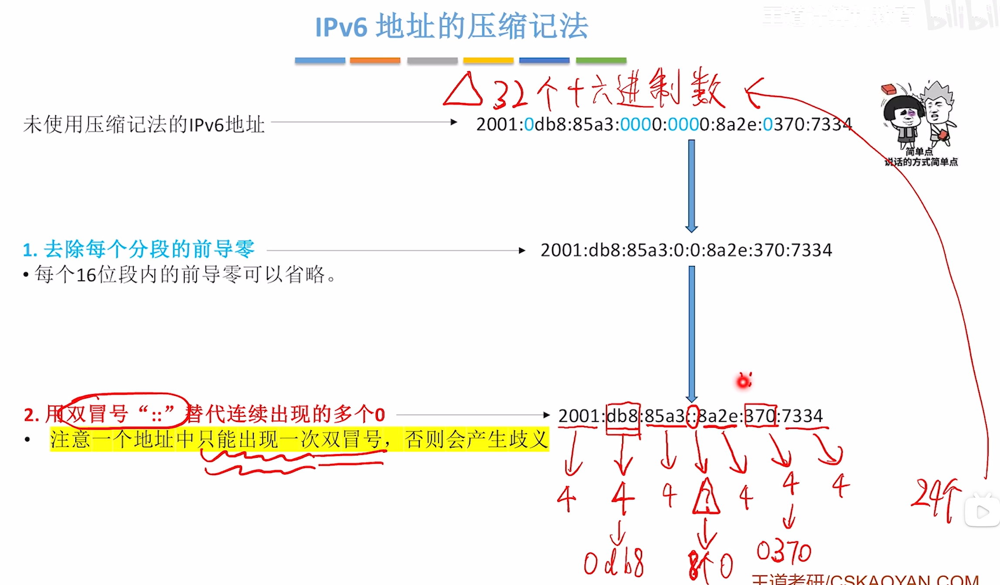
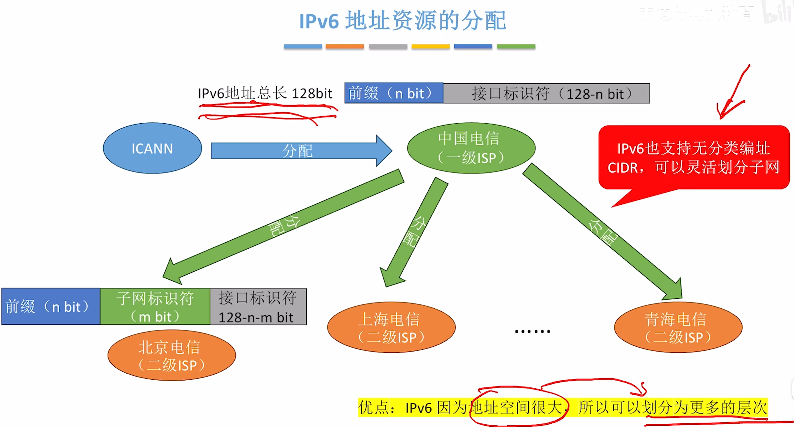
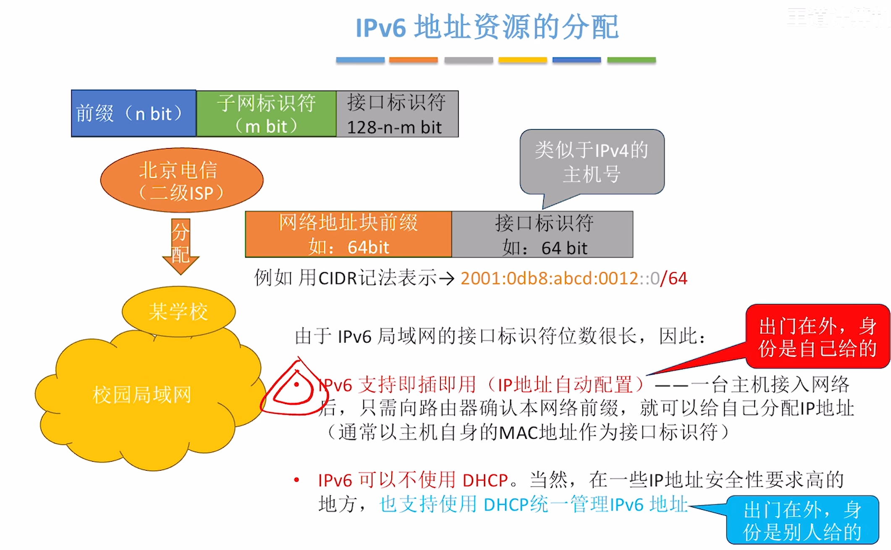
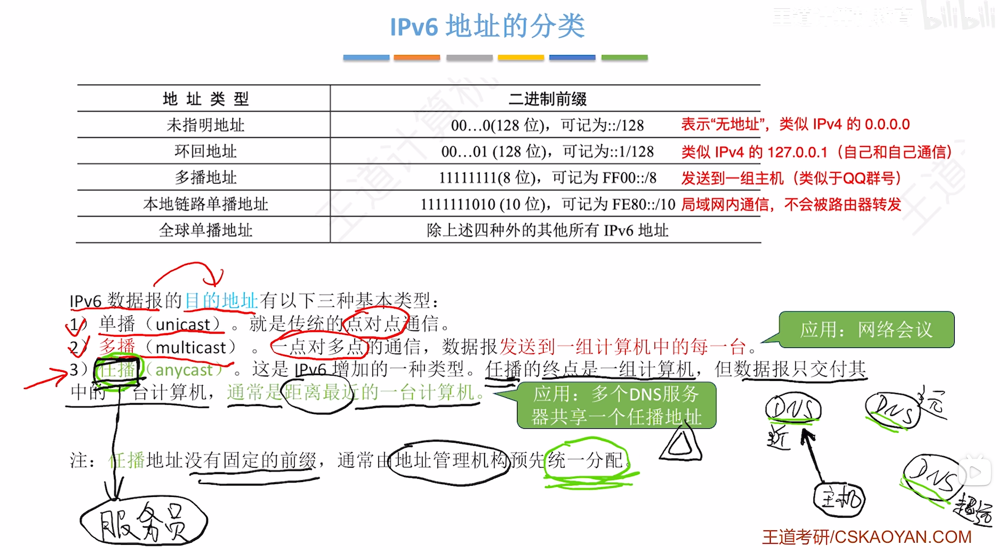

$$IPv6$$

**IPv4**:
- **IPv4 地址 = 32 位**
- $2^{32} \approx 42 亿$ 个地址
- **1994 年诞生** 的 **NAT** 只能缓解 IP 地址耗尽。
- IPv4 地址的 **点分十进制记法**：总共 32 bit 地址，8 bit 为一段，记录为十进制，段间以小数点分隔。

**IPv6**：
- **IPv6 地址 = 128 位**
- $2^{128} \approx  3.4 \times 10^{38}$ 个地址
- **IPv6 能彻底解决 IP 地址不够用的问题**。
- 每个设备都能拥有全球唯一 IP 地址。
- IPV6 地址的 **冒号十六进制记法**：总共 128 bit 地址，**16 bit 为一段，记录为十六进制，段间以冒号分隔**。

# 一、IPv6 地址的格式

- IPv6 地址总计 **128 bit**，采用冒号十六进制记法（16 位为一段，段间冒号分隔）。

{width=700}

- **压缩记法**
  - 每个 16 位段内的前导零可以省略。
  - 可用双冒号 **::** 替代连续出现的多个 0（注意 **一个地址中只能出现一次双冒号**）。

{width=700}

# 二、IPv6 地址资源的分配

- 一台主机的地址 = [n 位前缀，**128 - n 位接口标识符**]

{width=700}

{width=700}

# 三、IPv6 地址的分类

{width=700}

