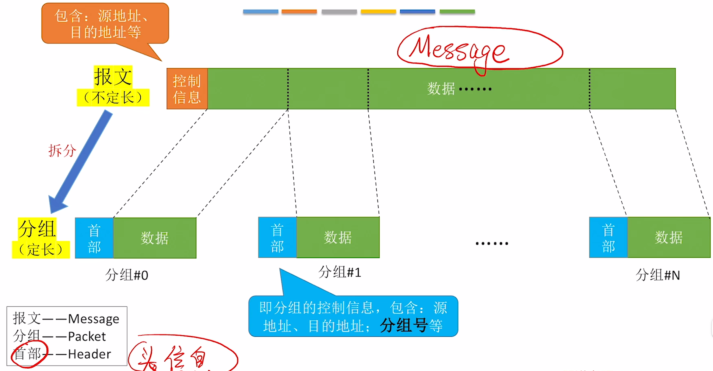
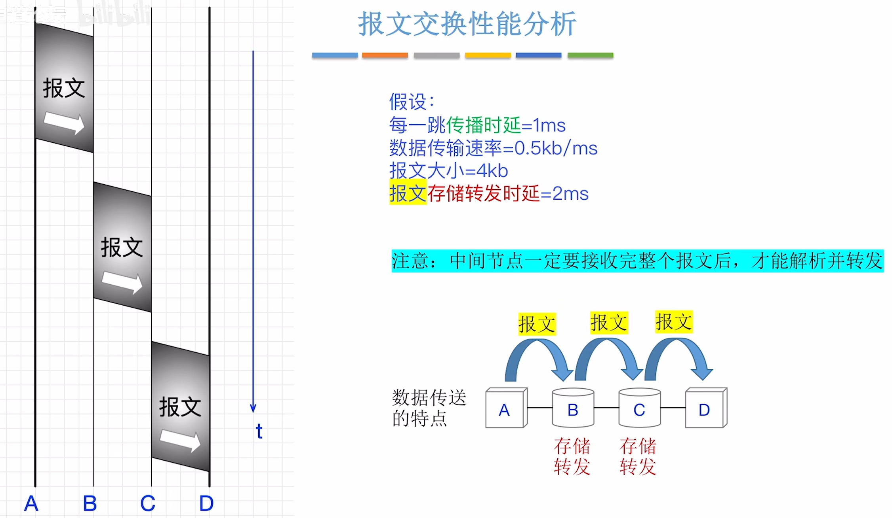

$$计算机网络概述$$

# 一、计算机网络的概念

## （一）计算机网络
**计算机网络（网络，Computer networking）** 是一个将众多 **分散的**、**自治的** 计算机系统，通过 **通信设备** 与 **线路** 连接起来，由功能完善的 **软件** 实现 **资源共享** 和 **信息传递** 的系统。
- 由若干 **结点（node）** 和连接这些结点的 **链路（link）** 组成。
  - 结点可以是计算机、集线器、交换机、路由器等。
    - **集线器（Hub）**：可以 **把多个结点连接起来，组成一个计算机网络**。
      - 会发生数据冲突。
      - 普通民用领域已很少使用。
      - 工作在物理层。
    - **交换机（Switch）**：可以 **把多个结点连接起来，组成一个计算机网络**。
      - 不会发生数据冲突。
      - 家庭、公司、学校通常用交换机组建内部网络。
      - 工作在数据链路层。
  - 链路可以是有限链路、无限链路。
- 计算机网络通常用 **云朵** 表示。

## （二）互连网

**互连网（internet）**：由 **路由器** **把两个或多个计算机网络相互连接起来**，形成规模更大的计算机网络，即 **互连网**。
- 路由器工作在网络层。
- 例如银行的内部网络。
- **互连网** 可使用 **任意协议** 通信。

**注意**：计网中的路由器与家用路由器有区别，**家用路由器 = 路由器 + 交换机 + 其他功能**。

## （三）互联网

**互联网（因特网，Internet）**：由各大 ISP 和国际机构组建的，覆盖全球范围的 **互连网（internet）**。
- **ISP（Internet Service Provider）**：互联网服务提供商。如中国电信/移动/联通。
- **互联网** 必须使用 **TCP/IP 协议** 通信。

# 二、计算机网络的组成

## （一）从组成部分看

1. **硬件**
   - **主机（端系统，end systen）**：如电脑、手机、物联网设备。
   - **通信设备**：如集线器、交换机、路由器。
   - **通信链路**：网线、双绞线、光纤、同轴电缆。

2. **软件**：方便用户使用，实现资源共享。
   - 如：Email 客户端、聊天软件、网盘软件。

3. **协议**：规定计算机网络中的通信规则。
   - 由硬件、软件共同实现。
   - 如：网络适配器 + 软件 实现网络通信协议。

- 主机内部安装 **网络适配器（网卡）**，将主机数据发到网络上，并接收来自网络的数据。

## （二）从工作方式看

1. **边缘部分**
   - 工作方式：直接为用户服务（通信、资源共享）。
   - 主要由连接到互联网上的主机及其软件组成。

2. **核心部分**
   - 工作方式：为边缘部分提供服务（**连通性、交换服务**）。
   - 由大量网络和连接这些网络的路由器组成。

## （三）从逻辑功能看

1. **资源子网**：计算机网络中运行应用程序，向用户提供可共享的硬件、软件和信息资源的部分。
   - 只要由连接到互联网上的主机组成。

2. **通信子网**：计算机网络中负责计算机间信息传输的部分。即把计算机和其他用户装置互连在一起的所有通信设备和介质的总称。
   - 主要由通信链路 + 通信设备 + 协议 组成。
   - **注意**：主机内部实现信息传输的网络适配器、低层协议属于通信子网范畴。

# 三、计算机网络的功能

1. **数据通信**：实现计算机之间的数据传送。
   - 是 **最基本、最重要** 的功能。

2. **资源共享**
   - **硬件资源共享**：如智能音响请求服务器处理。
   - **软件资源共享**：如应用商店。
   - **数据资源共享**：如分享视频。

3. **分布式处理**：将某个复杂任务分配给网络中多台计算机处理。
   - 如：大矩阵运算、MapReduce。

4. **提高可靠性**：网络中各台计算机互为替代机。
   - 如：某网盘服务器集群网络，数据冗余备份。

5. **负载均衡**：网络中各台计算机共同分担繁重任务。
   - 如：某游戏用多台服务器均衡处理玩家请求。

5. **其他**：满足社会需求、生活需求。
   - 如：远程办公、远程教育、娱乐。

# 四、电路交换、报文交换、分组交换

## （一）电路交换

**电路交换（Circuit Switching）**：通过物理线路的连接，**动态地分配传输线路资源**。

{width=500}

- 用于电话网络。

- 电路交换的过程：
  1. 建立连接（尝试占用通信资源）
  2. **通信（一直占用通信资源）**
  3. 释放连接（归还通信资源）

- 通信前从主叫端到被叫端建立一条 **专用的物理通路**，在通信的全部时间内，两个用户 **始终占用** 端到端的 **线路资源**。

- **优点**：
  - **通信时延小**：通信线路为通信双方专用，数据直达，**传输速率高**。
    - 所以电路交换适用于低频次、大量地传输数据。
  - **有序传输**：双方通信时按发送顺序传送数据，不存在失序问题。
  - **没有冲突**：不同的通信双方拥有不同的信道，不会出现争用物理信道的问题。
  - **实时性强**：通信双方之间的物理通路一旦建立，双方就可随时通信。

- **缺点**：
  - **建立/释放连接**，需要 **额外的时间开销**。
    - 计算机之间的数据往往是“突发式传输，即高频次、少量地传输数据。
  - **线路利用率低**：物理通路被通信双方独占，即使线路空闲，也不能供其他用户使用。
  - **灵活性差**：物理通路中的任何一点出现故障，就必须重新建立新的连接。
  - 交换节点 **不支持“差错控制”**，无法发现传输过程中发生的数据错误。

## （二）报文交换

电报网络采用 **报文交换** 技术。

{width=700}

- 用于电报网络。

- **存储转发** 的思想：把传送的数据单元先 **存储** 进中间节点，再根据目的地址 **转发** 至下一节点。
  - 每个报文都可单独选择到达目的端的路径。

- **报文（Message）** 是数据交换的单位。
  - 用户数据加上源地址、目的地址等信息后，封装成报文。

    |控制信息（发送方、接收方）|用户信息（用户数据）|
    |:-----:|:------:|

- **优点**：
  - 通信前 **无需建立连接**，没有建立连接时延，用户可随时发送报文。
  - 数据以 **报文** 为单位被交换节点间 **存储转发**，通信 **线路可以灵活分配**。
    - 若某条传输路径发生故障，则可重新选择另一条路径传输数据。
  - 在通信时间内，两个用户 **无需独占** 一整条物理线路。相比与电路交换，**线路利用率高**。
  - 交换节点 **支持“差错控制”**（通过校验技术）。

- **缺点**：
  - **报文不定长，不方便存储转发管理**。
  - **长报文的存储转发时间开销大、缓存开销大**。
  - **长报文容易出错，重传代价高**。

## （三）分组交换

**分组交换** 技术也采用 **存储转发** 技术。

- 用于现代计算机网络。

{width=700}
{width=700}

- **优点**：
  - 通信前 **无需建立连接**，没有建立连接时延，用户可随时发送报文。
  - 数据以 **分组** 为单位被交换节点间 **存储转发**，通信 **线路可以灵活分配**。
    - 若某条传输路径发生故障，则可重新选择另一条路径传输数据。
  - 在通信时间内，两个用户 **无需独占** 一整条物理线路。相比与电路交换，**线路利用率高**。
  - 交换节点 **支持“差错控制”**（通过校验技术）。
  - **分组定长，方便存储转发存储管理**。
  - **分组的存储转发时间开销小、缓存开销小**。
  - **分组不易出错，重传代价低**。

- **缺点**：
  - **相比与报文交换，控制信息占比增加**。
  - **相比与电路交换，依然存在存储转发时延**。
  - **报文被拆分为多个分组，传输过程中可能出现失序、丢失等问题，增加处理的复杂度**。

## （四）虚电路交换

**虚电路交换** 技术 **基于分组交换**。

- 虚电路交换的过程：
  1. **建立连接（虚拟电路）**
  2. **通信（分组按序、按已建立好的既定线路发送，通信双方不独占线路）**
  3. 释放连接

## （五）三种交换方式的性能分析

### 1. 电路交换性能分析

{width=700}

- 发送方 A 数据传送完成后，可以立即释放连接，不用等待 1 ms。

### 2. 报文交换性能分析

{width=700}

### 3. 分组交换性能分析

{width=700}

### 4. 三种交换方式的比较

{width=700}

# 五、计算机网络的分类

## （一）按分布范围分类

1. **广域网（WAN，Wide Area Network）**
   - 范围：几十 ~ 几千公里。
   - 跨省/跨国/跨洲。

2. **城域网（MAN，Metropolitan Area Network）**
   - 范围：几千米 ~ 几十千米。
   - 一个或几个相邻城市。
   - 通信技术：常采用 **以太网技术**，因此常并入局域网范畴探讨。

3. **局域网（LAN，Local Area Network）**
   - 范围：几十米 ~ 几千米。
   - 学校/企业/工作单位/家庭。
   - 通信技术：**以太网技术**

4. **个域网（PAN，Personal Area Network）**
   - 范围：几十米以内。
   - 家庭/个人。
   - 通常是通过无线技术将个人设备连接起来的网络。因此也称为 **无线个域网（WPAN，Wireless Personal Area Network）**。

## （二）按传输技术分类

1. **广播式网络**：当一台计算机发送数据分组时，广播范围内所有计算机都会收到该分组，并通过 **检查分组的目的地址** 决定是否接收该分组。

2. **点对点网络**：数据只会从发送方“点对点”发到接收方，精准送达。

## （三）按拓扑结构分类

1. **总线形结构**
   - 数据 **广播式** 传输。
   - 存在 **总线争用** 问题。
   - 典型代表：集线器连接的设备。
  

  {width=300}
  

2. **环形结构**
   - 数据 **广播式** 传输。
   - 通过 **“令牌（Token）”解决总线争用问题**，令牌顺环形依次传递，拿到令牌者可使用总线。
   - 典型代表：令牌环网（流行于 2000 年以前的局域网技术）。
  

  {width=300}
  

3. **星形结构**
   - 由中央设备实现数据的 **点对点** 传输。
   - **不存在“总线争用”** 问题。
   - 典型代表：以太网交换机连接等待设备。
  

  {width=300}
  

4. **网状结构**
   - 数据通过各中间节点逐一存储转发。
   - 属于 **点到点** 传输。
   - 数据通信采用 **分组交换** 技术。
   - 典型代表：由众多路由器构建的广域网。
   - 优点：灵活、可靠性高。
   - 缺点：控制复杂、线路成本高。
  

  {width=300}
  

- 总线形、环形、星形结构常见于局域网，网状结构常见于广域网。

## （四）按使用者分类

1. **共用网**：向公众开放的网络。
   - 如：办宽带、交手机话费即可使用的互联网。

2. **专用网**：仅供某个组织内部使用的网络。
   - 如：政府、军队、电力、银行的内部网络。

## （五）按传输介质分类

1. **有线网络**：如网线、光纤。

2. **无线网络**：如 5G、WiFi、卫星。

# 六、计算机网络的性能指标

1. **速率（数据率，比特率，数据传输速率，Speed）**：连接到网络上的节点在信道上传送数据的速率。
   - **速率单位**：$bit/s$，$b/s$，**$bps$**
   - **信道（Channel）**：向某一方向传送 **信息的通道**（信道 $\neq$ 通信线路）。
     - 一条通信线路在逻辑上往往对应一条 **发送信道** 和一条 **接收信道**。

2. **带宽（Bandwidth）**：某信道所能传送 **最高数据率**。
   - 单位：$bit/s$，$b/s$，**$bps$**
   - 带宽在 **《通信原理》** 中表示某信道 **允许通过的信号频带范围**。
     - 单位：**$Hz$**（赫/赫兹）

**注意**：**节点间通信实际能达到的最高速率，由带宽、节点性能共同限制**。

3. **吞吐量（Throughput）**: **单位时间** 内通过某个网络（或信道、接口）的 **实际数据量（实际的综合数据率）**。
   - 单位：$bit/s$，$b/s$，**$bps$**

4. **时延（延迟、迟延，Delay）**：数据（一个报文或分组，甚至比特）从网络（链路）的 **一端传送到另一端所需的时间**。
   **$$总时延 = 发送时延 + 传播时延 + 处理时延 + 排队时延$$**
   - **发送时延（传输时延）**：节点将数据推向信道所花的时间。
     - **$发送时延 = {数据长度（bit）\over {发送速率（bit/s）}}$**
   - **传播时延**：电磁波在信道中传播一定的距离所花的时间。
     - **$传播时延 = {信道长度（m）\over {电磁波在信道中的传播速度（m/s）}}$**
   - **处理时延**：被路由器处理所花的时间。（如：分析首部、查找存储转发表）
     - 受网络负载、路由器性能等诸多因素影响。考试中一般不用考虑。
   - **排队时延**：数据排队进入、排队发出路由器所花的时间。
     - 受网络负载、路由器性能等诸多因素影响。考试中一般不用考虑。

5. **时延带宽积**：一条链路中，**已** 从发送端 **发出但尚未到达** 接收端的 **最大比特数**。
   - 用于设计最短帧长。
   **$$时延带宽积 = 传播时延 \times 带宽$$**

6. **往返时延（RTT，Round-Trip Time）**：从发送方 **发送完数据**，到发送方 **收到来自接收方的确认** 总共经历的时间。
   

   {width=700}
   

7. **信道利用率**：某个信道有百分之多少的时间是有数据通过的。
   **$$信道利用率 = {有数据通过的时间 \over {有数据通过的时间 + 没有数据通过的时间}}$$**
   - **信道利用率不能太低，浪费资源**。
   - **信道利用率也不能太高，容易导致网络拥塞**。

# 七、计算机网络体系结构

## （一）网络体系结构的定义

**分层** 的设计思想：将庞大而复杂的问题，转化为若干较小的局部问题。
- **不同类型的节点，实现的功能层次可能不一样**。
- **分层结构的设计并不唯一**，可以根据实际需求增加或减少层次。
- **同一个功能** 可以在多个层次中重复出现。

**网络的体系结构（Network Architecture）**：计算机网络的各层及其协议的 **集合**，是这个计算机网络及其构件所应完成的 **功能的精确定义（不涉及实现）**。
  - **实现（Implementation）**：遵循这种体系结构的前提下，用何种硬件或软件完成这些功能的问题。
  - 体系结构是 **抽象** 的，实现是 **具体** 的。

{width=700}

## （二）各层之间的关系

{width=700}

**实体**：第 n 层中的活动元素（软件 + 硬件）称为 **第 n 层实体**。

- **对等层**：不同机器上的同一层。

- **对等实体**：同一层的实体。

**协议（网络协议，Network Protocol）**：控制对等实体之间进行通信的规则的集合，**是水平的**。
- 协议由 **语法、语义、同步** 三部分组成（**协议的三要素**）。
  - **语法**：数据与控制信息的格式。
    - 如：协议控制信息（首部）部分占几个字节、每个字节是说明含义；协议的数据部分最多有几个字节。
  - **语义**：需要发出何种控制信息、完成何种动作及做出何种应答。
  - **同步（时序）**：执行各种操作的条件、时序关系等，即事件实现顺序的详细说明。

{width=700}

**接口（服务访问点，SAP，Service Access Point）**：同一节点内 **相邻两层的实体** 交换信息的逻辑接口。

**服务**：**下层为紧邻的上层** 提供的功能调用，**是垂直的**。

## （三）数据的传输过程

{width=700}

{width=700}

## （四）PDU、SDU、PCI

{width=700}

**协议数据单元（PDU）**：对等层次之间传送的数据单位。
- 第 n 层的 PDU 记为 n-PDU。

**服务数据单元（SDU）**：为完成上一层实体所要求的功能而传送的数据。
- 第 n 层的 SDU 记为 n-SDU。

**协议控制信息（PCI）**：控制协议操作的信息。
- 第 n 层的 PCI 记为 n-PCI。

**$$n-SDU + n-PCI = n-PDU = (n-1)-SDU$$**

# 八、OSI 参考模型

{width=700}

## （一）各层名称和顺序

{width=300}

## （二）常见网络设备的功能层次

{width=700}

## （三）1 层 —— 物理层

{width=700}

**物理层** 任务：实现 **相邻节点** 之间 **比特（0 或 1）的传输**。

- 主要任务：
  - 需定义电路接口参数（如：形状、尺寸、引脚数等）。
  - 需定义传输信号的含义、电气特性（如：5V 表示 1，1V 表示 0；每比特电信号持续时间 0.1ms）。

## （四）2 层 —— 数据链路层

{width=700}

**数据链路层** 任务：确保 **相邻节点** 之间的链路 **逻辑上无差错**。

- 功能：
  - **差错控制**：
    1. 检错 + 纠错
    2. 检错 + 丢弃 + 重传
    - 确保局部（帧）正确。
  - **流量控制**：协调两个节点的速率。

## （五）3 层 —— 网络层

{width=700}

**网络层** 任务：**把“分组”从源节点转发到目的节点**。

- 功能：
  - **路由选择**：构造并维护路由表，决定分组到达目的节点的最佳路径。
  - **分组转发**：将“分组”从合适的端口转发出去。
  - **拥塞控制**：发现网络拥塞，并采取措施缓解拥塞。
  - **网际互联**：实现异构网络互联。
  - 其他功能：
    - **差错控制**：以“分组”为单位，确保全局正确（分组中不缺帧）。
    - **流量控制**：以“分组”为单位。
    - **连接建立与释放**：确保分组有序、不重复达到。
    - **可靠传输管理**：接收方需返回分组确认消息。

## （六）4 层 —— 传输层

{width=700}

**传输层** 任务：实现 **端到端** 通信（实现 **进程到进程** 的通信，“端”指 **端口**）。

- 功能：
  - **复用和分用**：发送端几个高层实体复用一条低层的连接，在接收端再进行分用。
  - 其他功能：
    - **差错控制**：以 **报文段** 为单位。
    - **流量控制**
    - **连接建立与释放**：确保报文段有序、不重复到达。
    - **可靠传输管理**：接收方需返回报文段确认信息。

- 每个进程绑定一个 **端口号**。

## （七）5 ~ 7 层

- **5 层 —— 会话层** 任务：管理进程间会话。
  - 主要功能：**会话管理**（采用检查点机制，当通信失效时从检查点继续恢复通信）。

- **6 层 —— 表示层** 任务：解决不同主机上信息表示不一致的问题。
  - 主要功能：**数据格式转换**（如：编码转换、压缩/解压、加密/解密）。

- **7 层 —— 应用层** 任务：实现特定的网络应用。
  - 功能繁多，根据应用需求设计。
  - 以 **报文（Message）** 为单位传输。

## （八）各层数据传输单位

{width=700}

# 九、TCP/IP 模型

{width=700}

## （一）各层名称和顺序

{width=300}

## （二）1 层 —— 网络接口层

**网络接口层** 任务：实现相邻节点间的数据传输（为网络层传输“分组”），但 **具体怎么传不作规定**（交给网络设备商自由发挥）。

- 网络硬件种类繁多，不应该有过多限制。

- 这一层使得 TCP/IP 网络体系结构具有更强的灵活性、适应性。

## （三）2 层 —— 网络层

**网络层** 功能：**路由选择**、**分组转发**、拥塞控制、网际互联。

- TCP/IP 网络层只保证“尽最大能力交付”，数据传输是不可靠的。

## （四）3 层 —— 传输层

**传输层** 功能：**复用和分用**、**差错控制**、**流量控制**、**连接建立与释放**、**可靠传输管理**。

- 在 TCP/IP 模型中，由传输层负责保证数据传输的正确性、可靠性。
- 网络核心部分（路由器）的功能简单，负载低。
- 数据传输的正确、可靠由传输层负责，压力给到“网络边缘部分”（主机）。

## （五）4 层 —— 应用层

**应用层** 任务：实现特定的网络应用（功能复杂且多样）。

- 并不是所有网络应用都需要 **数据格式转换**、**会话管理功能**。
- TCP/IP 的理念：如果某些应用需要 **数据格式转换、会话管理** 功能，就交给应用层的特定协议去实现。

# 十、OSI 参考模型与 TCP/IP 模型的比较

{width=700}

{width=700}

